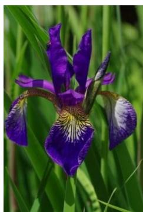
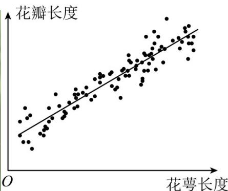

<!-- question-source:start -->
7. 调查某种群花萼长度和花瓣长度，所得数据如图所示，其中相关系数 $r = 0.8245$ ，下列说法正确的是（）

A. 花瓣长度和花萼长度没有相关性  
B. 花瓣长度和花萼长度呈现负相关  
C. 花瓣长度和花萼长度呈现正相关  
D. 若从样本中抽取一部分，则这部分的相关系数一定是0.8245
<!-- question-source:end -->

![[高中/真题/按年份分类/2023/精品解析_2023年新高考天津数学高考真题_解析版_/一_选择题_在每小题给出的四个选项中_只有一项是符合题目要求的_/题目/answers/Q00020639A1.md]]
