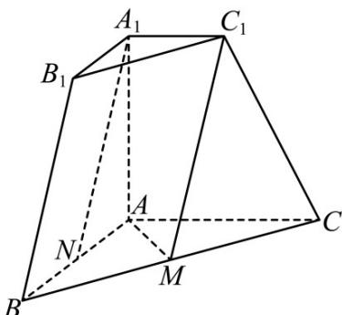

<!-- question-source:start -->
17. 三棱台 $ABC - A_{1}B_{1}C_{1}$ 中，若 $A_{1}A \perp$ 面 $ABC, AB \perp AC, AB = AC = AA_{1} = 2, A_{1}C_{1} = 1$ ， $M, N$ 分别是 $BC, BA$ 中点.

(1) 求证: $A_{1}N$ //平面 $C_{1}MA$ ;

(2) 求平面 $C_{1}MA$ 与平面 $ACC_{1}A_{1}$ 所成夹角的余弦值；

(3) 求点 $C$ 到平面 $C_{1}MA$ 的距离.

【
<!-- question-source:end -->

![[高中/真题/按年份分类/2023/精品解析_2023年新高考天津数学高考真题_解析版_/解答题/题目/answers/Q00021616A1.md]]
