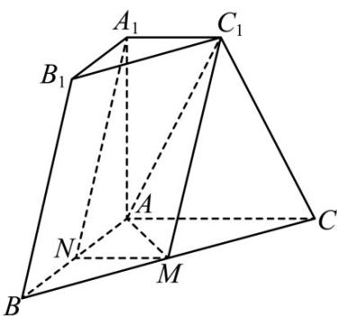
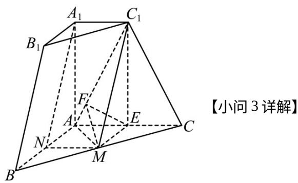
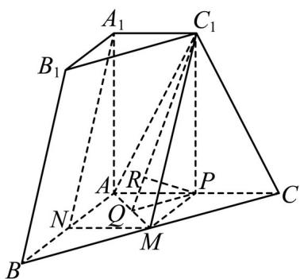
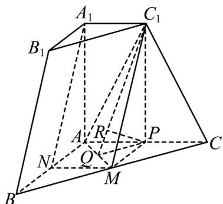

> [!faq]- 精品解析：2023年新高考天津数学高考真题（解析版）解析
>
> > [!success]- **【答案】** （1）证明见
>
> > [!note]- **【分析】**
> > （1）先证明四边形 $MNA_{1}C_{1}$ 是平行四边形，然后用线面平行的判定解决；
>
> > [!note]- **【解析】**
> > 
> >
> > 连接 $MN, C_1A$ . 由 $M, N$ 分别是 $BC, BA$ 的中点，根据中位线性质， $MN // AC$ ，且 $MN = \frac{AC}{2} = 1$
> >
> > 由棱台性质， $A_{1}C_{1} / / AC$ ，于是 $MN / / A_{1}C_{1}$ ，由 $MN = A_{1}C_{1} = 1$ 可知，四边形 $MNA_{1}C_{1}$ 是平行四边形，则
> >
> > $$
> > A _ {1} N _ {/ /} M C _ {1}
> > $$
> >
> > 又 $A_{1}N \not\subset$ 平面 $C_{1}MA$ ， $MC_{1} \subset$ 平面 $C_{1}MA$ ，于是 $A_{1}N // \text{平面 } C_{1}MA$ .
> >
> > 【
> >
> > 小问 2
> >
> > 过 $M$ 作 $ME \perp AC$ ，垂足为 $E$ ，过 $E$ 作 $EF \perp AC_1$ ，垂足为 $F$ ，连接 $MF, C_1 E$ 。
> >
> > 由 $ME \subset$ 面 ABC， $A_{1}A \perp$ 面 ABC，故 $AA_{1} \perp ME$ ，又 $ME \perp AC$ ， $AC \cap AA_{1} = A$ ， $AC, AA_{1} \subset$ 平面
> >
> > $ACC_{1}A_{1}$ ，则 $ME \perp$ 平面 $ACC_{1}A_{1}$ .
> >
> > 由 $AC_{1} \subset$ 平面 $ACC_{1}A_{1}$ ，故 $ME \perp AC_{1}$ ，又 $EF \perp AC_{1}$ ， $ME \cap EF = E$ ， $ME, EF \subset$ 平面 $MEF$ ，于是
> >
> > $AC_{1} \perp$ 平面 MEF，
> >
> > 由 $MF \subset$ 平面 $MEF$ ，故 $AC_{1} \perp MF$ 。于是平面 $C_{1}MA$ 与平面 $ACC_{1}A_{1}$ 所成角即 $\angle MFE$ 。
> >
> > 又 $ME = \frac{AB}{2} = 1$ ， $\cos \angle CAC_{1} = \frac{1}{\sqrt{5}}$ ，则 $\sin \angle CAC_{1} = \frac{2}{\sqrt{5}}$ ，故 $EF = 1\times \sin \angle CAC_{1} = \frac{2}{\sqrt{5}}$ ，在
> >
> > Rt△MEF 中， $\angle MEF=90^{\circ}$ ，则 $MF=\sqrt{1+\frac{4}{5}}=\frac{3}{\sqrt{5}}$
> >
> > 于是 $\cos\angle MFE=\frac{EF}{MF}=\frac{2}{3}$
> >
> > 
> >
> > [方法一：几何法]
> >
> > 
> >
> > 过 $C_{1}$ 作 $C_{1}P \perp AC$ ，垂足为 $P$ ，作 $C_{1}Q \perp AM$ ，垂足为 $Q$ ，连接 $PQ, PM$ ，过 $P$ 作 $PR \perp C_{1}Q$ ，垂足为 $R$ .
> >
> > 由题干数据可得， $C_1A = C_1C = \sqrt{5}$ ， $C_1M = \sqrt{C_1P^2 + PM^2} = \sqrt{5}$ ，根据勾股定理，
> >
> > $$
> > C _ {1} Q = \sqrt {5 - \left(\frac {\sqrt {2}}{2}\right) ^ {2}} = \frac {3 \sqrt {2}}{2},
> > $$
> >
> > 由 $C_{1}P \perp$ 平面 $AMC$ ， $AM \subset$ 平面 $AMC$ ，则 $C_{1}P \perp AM$ ，又 $C_{1}Q \perp AM$ ， $C_{1}Q \cap C_{1}P = C_{1}$ ，
> >
> > $$
> > C _ {1} Q, C _ {1} P \subset_ {\text {平面}} C _ {1} P Q, \text {于是} A M \perp \text {平面} C _ {1} P Q.
> > $$
> >
> > 又 $PR \subset$ 平面 $C_1PQ$ ，则 $PR \perp AM$ ，又 $PR \perp C_1Q$ ， $C_1Q \cap AM = Q$ ， $C_1Q, AM \subset$ 平面 $C_1MA$ ，故 $PR \perp$ 平面 $C_1MA$ .
> >
> > 在 $\mathrm{Rt}\triangle C_1PQ$ 中， $PR = \frac{PC_1\cdot PQ}{QC_1} = \frac{2\cdot\frac{\sqrt{2}}{2}}{\frac{3\sqrt{2}}{2}} = \frac{2}{3},$
> >
> > 又 $CA = 2PA$ ，故点 $C$ 到平面 $C_1MA$ 的距离是 $P$ 到平面 $C_1MA$ 的距离的两倍，
> >
> > 即点 C 到平面 $C_{1}MA$ 的距离是 $\frac{4}{3}$ .
> >
> > [方法二：等体积法]
> >
> > 
> >
> > 辅助线同方法一.
> >
> > 设点 $C$ 到平面 $C_{1}MA$ 的距离为 $h$ .
> >
> > $$
> > V _ {C _ {1} - A M C} = \frac {1}{3} \times C _ {1} P \times S _ {\triangle A M C} = \frac {1}{3} \times 2 \times \frac {1}{2} \times (\sqrt {2}) ^ {2} = \frac {2}{3},
> > $$
> >
> > $$
> > V _ {C - C _ {1} M A} = \frac {1}{3} \times h \times S _ {\triangle A M C _ {1}} = \frac {1}{3} \times h \times \frac {1}{2} \times \sqrt {2} \times \frac {3 \sqrt {2}}{2} = \frac {h}{2}.
> > $$
> >
> > 由 $V_{C_1 - AMC} = V_{C - C_1MA}\Leftrightarrow \frac{h}{2} = \frac{2}{3}$ ，即 $h = \frac{4}{3}.$
