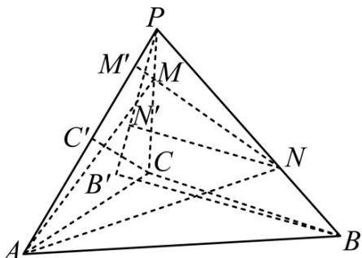

> [!faq]- 精品解析：2023年新高考天津数学高考真题（解析版）解析
>
> > [!success]- **【答案】** B
>
> > [!note]- **【分析】**
> > 分别过 $M, C$ 作 $MM' \perp PA, CC' \perp PA$ , 垂足分别为 $M', C'$ . 过 $B$ 作 $BB' \perp$ 平面 $PAC$ , 垂足为 $B'$ , 连接 $PB'$ , 过 $N$ 作 $NN' \perp PB'$ , 垂足为 $N'$ . 先证 $NN' \perp$ 平面 $PAC$ , 则可得到 $BB' // NN'$ , 再证 $MM' // CC'$ .
>
> > [!note]- **【解析】**
> > 如图，分别过 M, C 作 $MM' \perp PA, CC' \perp PA$ ，垂足分别为 $M', C'$ . 过 $_{B}$ 作 $BB' \perp$ 平面 PAC，垂足为 $B'$ ，连接 $PB'$ ，过 N 作 $NN' \perp PB'$ ，垂足为 $N'$ .
> >
> > 
> >
> > 因为 $BB^{\prime} \perp$ 平面 $PAC$ ， $BB^{\prime} \subset$ 平面 $PBB^{\prime}$ ，所以平面 $PBB^{\prime} \perp$ 平面 $PAC$ 。
> >
> > 又因为平面 $PBB^{\prime} \cap$ 平面 $PAC = PB^{\prime}$ , $NN^{\prime} \perp PB^{\prime}$ , $NN^{\prime} \subset$ 平面 $PBB^{\prime}$ , 所以 $NN^{\prime} \perp$ 平面 $PAC$ , 且 $BB^{\prime} // NN^{\prime}$ .
> >
> > 在 $\triangle PCC'$ 中，因为 $MM' \perp PA, CC' \perp PA$ ，所以 $MM' // CC'$ ，所以 $\frac{PM}{PC} = \frac{MM'}{CC'} = \frac{1}{3}$ ，
> >
> > 在 $\triangle PBB'$ 中，因为 $BB'//NN'$ ，所以 $\frac{PN}{PB} = \frac{NN'}{BB'} = \frac{2}{3}$ ，
> >
> > $$
> > \frac {V _ {P - A M N}}{V _ {P - A B C}} = \frac {V _ {N - P A M}}{V _ {B - P A C}} = \frac {\frac {1}{3} S _ {\triangle P A M} \cdot N N ^ {\prime}}{\frac {1}{3} S _ {\triangle P A C} \cdot B B ^ {\prime}} = \frac {\frac {1}{3} \cdot \left(\frac {1}{2} P A \cdot M M ^ {\prime}\right) \cdot N N ^ {\prime}}{\frac {1}{3} \cdot \left(\frac {1}{2} P A \cdot C C ^ {\prime}\right) \cdot B B ^ {\prime}} = \frac {2}{9}
> > $$
> >
> > 故选：B
