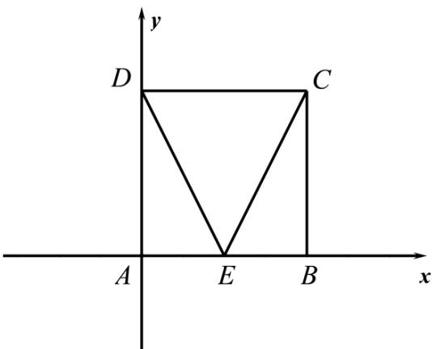

> [!faq]- 精品解析：2023年高考全国乙卷数学(文)真题（解析版）解析
>
> > [!success]- **【答案】** B
>
> > [!note]- **【分析】**
> > 方法一：以 $\left\{AB, AD\right\}$ 为基底向量表示 $EC, ED$ ，再结合数量积的运算律运算求解；方法二：建
>
> > [!note]- **【解析】**
> > 方法一：以 $\left\{AB, AD\right\}$ 为基底向量，可知 $\left|AB\right| = \left|AD\right| = 2, AB \cdot AD = 0$
> >
> > $$
> > \underset {E C} {\text { u   u }} = E B + B C = \frac {1}{2} A B + A D, E D = E A + A D = - \frac {1}{2} A B + A D
> > $$
> >
> > 所以 $EC \cdot ED = \left( \frac{1}{2} AB + AD \right) \cdot \left( -\frac{1}{2} AB + AD \right) = -\frac{1}{4} AB^{2} + AD^{2} = -1 + 4 = 3;$
> >
> > 方法二：如图，以 A 为坐标原点建立平面直角坐标系，
> >
> > 则 $E(1,0),C(2,2),D(0,2)$ ，可得 $\overline{EC} = (1,2),\overline{ED} = (-1,2)$
> >
> > 所以 $EC \cdot ED = -1 + 4 = 3$
> >
> > 方法三：由题意可得： $ED = EC = \sqrt{5},CD = 2$
> >
> > 在 $\triangle CDE$ 中，由余弦定理可得 $\cos \angle DEC = \frac{DE^2 + CE^2 - DC^2}{2DE \cdot CE} = \frac{5 + 5 - 4}{2 \times \sqrt{5} \times \sqrt{5}} = \frac{3}{5}$ ，
> >
> > 所以 $EC \cdot ED = |EC||ED| \cos \angle DEC = \sqrt{5} \times \sqrt{5} \times \frac{3}{5} = 3.$
> >
> > 故选：B
> >
> > 
