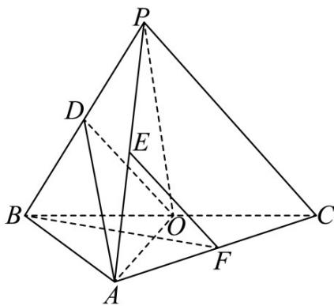

<!-- question-source:start -->
19. 如图，在三棱锥 $P - ABC$ 中， $AB \perp BC$ ， $AB = 2$ ， $BC = 2\sqrt{2}$ ， $PB = PC = \sqrt{6}$ ， $BP, AP, BC$ 的

中点分别为 D, E, O，点 F 在 AC 上， $BF \perp AO$ .

(1) 求证: $EF$ //平面 $ADO$ ;

(2) 若 $\angle POF = 120^{\circ}$ ，求三棱锥 $P - ABC$ 的体积.
<!-- question-source:end -->

![[高中/真题/按年份分类/2023/精品解析_2023年高考全国乙卷数学_文_真题_解析版_/三_解答题/题目/answers/Q00020671A1.md]]
