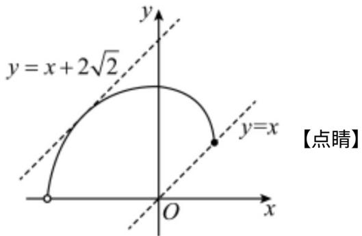

> [!faq]- 精品解析：2023年高考全国乙卷数学(文)真题（解析版）解析
>
> > [!success]- **【答案】** (1) $x^{2} + (y - 1)^{2} = 1, x \in [0,1], y \in [1,2]$ (2) $(- \infty, 0) \cup (2\sqrt{2}, +\infty)$
>
> > [!note]- **【分析】**
> > （1）根据极坐标与直角坐标之间的转化运算求解，注意 $x, y$ 的取值范围；
> >
> > (2) 根据曲线 $C_1, C_2$ 的方程，结合图形通过平移直线 $y = x + m$ 分析相应的临界位置，结合点到直线的距离公式运算求解即可.
>
> > [!note]- **【解析】**
> > 【小问 1 详解】
> >
> > 因为 $\rho=2\sin\theta$ ，即 $\rho^{2}=2\rho\sin\theta$ ，可得 $x^{2}+y^{2}=2y$ ，
> >
> > 整理得 $x^{2} + (y - 1)^{2} = 1$ ，表示以 $(0,1)$ 为圆心，半径为1的圆，
> >
> > 又因为 $x=\rho\cos\theta=2\sin\theta\cos\theta=\sin2\theta,\ y=\rho\sin\theta=2\sin^{2}\theta=1-\cos2\theta$
> >
> > 且 $\frac{\pi}{4} \leq \theta \leq \frac{\pi}{2}$ ，则 $\frac{\pi}{2} \leq 2\theta \leq \pi$ ，则 $x = \sin 2\theta \in [0,1], y = 1 - \cos 2\theta \in [1,2]$ ，
> >
> > 故 $C_1: x^2 + (y - 1)^2 = 1, x \in [0,1], y \in [1,2]$ .
> >
> > 【小问 2 详解】
> >
> > 因 $C_{2}:\left\{\begin{aligned}&x=2\cos\alpha\\ &y=2\sin\alpha\end{aligned}\right.$ ( $\alpha$ 为参数， $\frac{\pi}{2}<\alpha<\pi$ )，
> >
> > 整理得 $x^{2} + y^{2} = 4$ ，表示圆心为 $O(0,0)$ ，半径为2，且位于第二象限的圆弧，
> >
> > 如图所示，若直线 $y = x + m$ 过(1,1)，则 $1 = 1 + m$ ，解得 $m = 0$ ；
> >
> > 若直线 $y = x + m$ ，即 $x - y + m = 0$ 与相切，则 $\left\{ \begin{array}{l} \frac{|m|}{\sqrt{2}} = 2 \\ m > 0 \end{array} \right.$ ，解得 $m = 2\sqrt{2}$
> >
> > 若直线 $y = x + m$ 与 $C_{1}, C_{2}$ 均没有公共点，则 $m > 2\sqrt{2}$ 或 m < 0，
> >
> > 即实数 m 的取值范围 $(-∞,0)∪(2√2,+∞)$ .
> >
> > 
> >
> > 【选修4-5】（10分）
