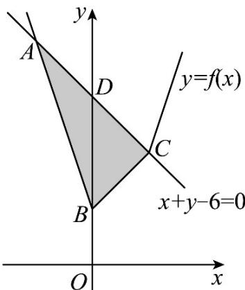

> [!faq]- 精品解析：2023年高考全国乙卷数学(文)真题（解析版）解析
>
> > [!success]- **【答案】** (1) $[-2, 2]$ ; (2) 8.
>
> > [!note]- **【分析】**
> > （1）分段去绝对值符号求解不等式作答.
> >
> > (2) 作出不等式组表示的平面区域，再求出面积作答.
>
> > [!note]- **【解析】**
> > 【小问 1 详解】
> >
> > 依题意， $f(x) = \left\{ \begin{array}{ll}3x - 2,x > 2\\ x + 2,0\leq x\leq 2\\ -3x + 2,x <   0 \end{array} \right.$
> >
> > 不等式 $f(x)\leq 6 - x$ 化为： $\left\{ \begin{array}{ll}x > 2 & 0\leq x\leq 2\\ 3x - 2\leq 6 - x\end{array} \right.$ 或 $\left\{ \begin{array}{ll}x + 2\leq 6 - x\end{array} \right.$ 或 $\left\{ \begin{array}{ll}x <   0\\ -3x + 2\leq 6 - x \end{array} \right.$
> >
> > 解 $\left\{ \begin{array}{l}x > 2\\ 3x - 2\leq 6 - x \end{array} \right.$ ，得无解；解 $\left\{ \begin{array}{ll}0\leq x\leq 2\\ x + 2\leq 6 - x \end{array} \right.$ ，得 $0\leq x\leq 2$ ，解 $\left\{ \begin{array}{ll}x <   0\\ -3x + 2\leq 6 - x \end{array} \right.$ ，得 $-2\leq x <   0$ ，因此
> >
> > $$
> > - 2 \leq x \leq 2
> > $$
> >
> > 所以原不等式的解集为： $[-2,2]$
> >
> > 【小问 2 详解】
> >
> > 作出不等式组 $\left\{\begin{aligned}f(x)\leq y\\ x+y-6\leq0\end{aligned}\right.$ 表示的平面区域，如图中阴影 $\triangle ABC$ ，
> >
> > 
> >
> > 由 $\left\{ \begin{array}{l} y = -3x + 2 \\ x + y = 6 \end{array} \right.$ ，解得 $A(-2,8)$ ，由 $\left\{ \begin{array}{l} y = x + 2 \\ x + y = 6 \end{array} \right.$ ，解得 $C(2,4)$ ，又 $B(0,2), D(0,6)$ ，
> >
> > 所以 $\triangle ABC$ 的面积 $S_{\triangle ABC} = \frac{1}{2}|BD|\times |x_C - x_A| = \frac{1}{2}|6 - 2|\times |2 - (-2)| = 8.$
