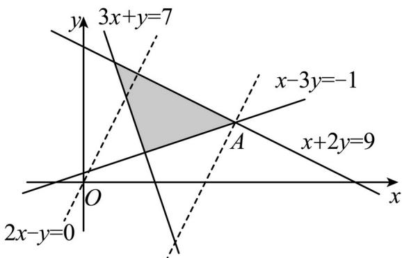

> [!faq]- 精品解析：2023年高考全国乙卷数学(文)真题（解析版）解析
>
> > [!success]- **【答案】** 8
>
> > [!note]- **【分析】**
> > 作出可行域，转化为截距最值讨论即可.
>
> > [!note]- **【解析】**
> > 作出可行域如下图所示：
> >
> > $z=2x-y$ ，移项得 $y=2x-z$ ，
> >
> > 联立有 $\left\{ \begin{array}{l}x - 3y = -1\\ x + 2y = 9 \end{array} \right.$ ，解得 $\left\{ \begin{array}{l}x = 5\\ y = 2 \end{array} \right.$
> >
> > 设 $A(5,2)$ ，显然平移直线 $y = 2x$ 使其经过点 $\mathrm{A}$ ，此时截距 $-z$ 最小，则 $z$ 最大，
> >
> > 代入得 z = 8，
> >
> > 故答案为：8.
> >
> > 
