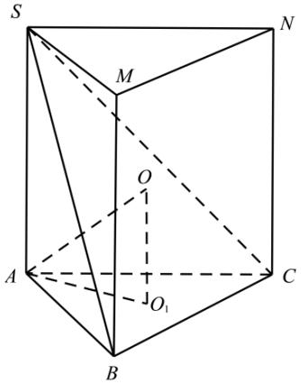

> [!faq]- 精品解析：2023年高考全国乙卷数学(文)真题（解析版）解析
>
> > [!success]- **【答案】** 2
>
> > [!note]- **【分析】**
> > 先用正弦定理求底面外接圆半径，再结合直棱柱的外接球以及求的性质运算求解.
>
> > [!note]- **【解析】**
> > 如图，将三棱锥 S - ABC 转化为直三棱柱 SMN - ABC，
> >
> > 设 $\triangle ABC$ 的外接圆圆心为 $O_{1}$ ，半径为 r，
> >
> > 则 $2r = \frac{AB}{\sin\angle ACB} = \frac{3}{\frac{\sqrt{3}}{2}} = 2\sqrt{3}$ ，可得 $r = \sqrt{3}$
> >
> > 设三棱锥 $S - ABC$ 的外接球球心为 $O$ ，连接 $OA, OO_1$ ，则 $OA = 2, OO_1 = \frac{1}{2} SA$
> >
> > 因为 $OA^{2}=OO_{1}^{2}+O_{1}A^{2}$ ，即 $4=3+\frac{1}{4}SA^{2}$ ，解得 SA=2。
> >
> > 故答案为：2.
> >
> > 
> >
> > 【点睛】方法点睛：多面体与球切、接问题的求解方法
> > (1) 涉及球与棱柱、棱锥的切、接问题时，一般过球心及多面体的特殊点(一般为接、切点)或线作截面，把空间问题转化为平面问题求解；
