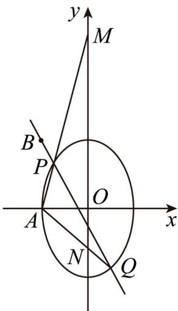

> [!faq]- 精品解析：2023年高考全国乙卷数学(文)真题（解析版）解析
>
> > [!success]- **【答案】** （1） $\frac{y^{2}}{9}+\frac{x^{2}}{4}=1$ (2) 证明见
>
> > [!note]- **【分析】**
> > （1）根据题意列式求解 $a, b, c$ ，进而可得结果；
>
> > [!note]- **【解析】**
> > 【
> >
> > 由题意可得 $\begin{cases} b = 2 \\ a^2 = b^2 + c^2 \\ e = \frac{c}{a} = \frac{\sqrt{5}}{3} \end{cases}$ ，解得 $\begin{cases} a = 3 \\ b = 2 \\ c = \sqrt{5} \end{cases}$ 所以椭圆方程为 $\frac{y^2}{9} + \frac{x^2}{4} = 1$ .
> >
> > 【
> >
> > 小问2
> >
> > 由题意可知：直线 $PQ$ 的斜率存在，设 $PQ: y = k(x + 2) + 3, P(x_1, y_1), Q(x_2, y_2)$ ,
> >
> > 联立方程 $\begin{cases} y = k(x + 2) + 3 \\ \frac{y^2}{9} + \frac{x^2}{4} = 1 \end{cases}$ ，消去 $y$ 得： $(4k^2 + 9)x^2 + 8k(2k + 3)x + 16(k^2 + 3k) = 0$ ，
> >
> > 则 $\Delta = 64k^2(2k + 3)^2 - 64(4k^2 + 9)(k^2 + 3k) = -1728k > 0$ ，解得 $k < 0$ ，
> >
> > 可得 $x_1 + x_2 = -\frac{8k(2k + 3)}{4k^2 + 9}, x_1x_2 = \frac{16(k^2 + 3k)}{4k^2 + 9}$ ,
> >
> > 因为 $A(-2,0)$ ，则直线 $AP: y = \frac{y_1}{x_1 + 2}(x + 2)$ ,
> >
> > 令 $x = 0$ ，解得 $y = \frac{2y_1}{x_1 + 2}$ ，即 $M\left(0, \frac{2y_1}{x_1 + 2}\right)$ ,
> >
> > 同理可得 $N\left(0, \frac{2y_2}{x_2 + 2}\right)$ ,
> >
> > 则 $\frac{2y_1}{x_1 + 2} + \frac{2y_2}{x_2 + 2} = \frac{k(x_1 + 2) + 3}{x_1 + 2} + \frac{k(x_2 + 2) + 3}{x_2 + 2}$
> >
> > $$
> > = \frac {\left[ k x _ {1} + (2 k + 3) \right] \left(x _ {2} + 2\right) + \left[ k x _ {2} + (2 k + 3) \right] \left(x _ {1} + 2\right)}{\left(x _ {1} + 2\right) \left(x _ {2} + 2\right)} = \frac {2 k x _ {1} x _ {2} + (4 k + 3) \left(x _ {1} + x _ {2}\right) + 4 (2 k + 3)}{x _ {1} x _ {2} + 2 \left(x _ {1} + x _ {2}\right) + 4}
> > $$
> >
> > $$
> > = \frac {\frac {3 2 k (k ^ {2} + 3 k)}{4 k ^ {2} + 9} - \frac {8 k (4 k + 3) (2 k + 3)}{4 k ^ {2} + 9} + 4 (2 k + 3)}{\frac {1 6 (k ^ {2} + 3 k)}{4 k ^ {2} + 9} - \frac {1 6 k (2 k + 3)}{4 k ^ {2} + 9} + 4} = \frac {1 0 8}{3 6} = 3,
> > $$
> >
> > 所以线段MN的中点是定点 $(0,3)$ .
> >
> > 
> >
> > 【点睛】方法点睛：求解定值问题的三个步骤
> >
> > (1) 由特例得出一个值，此值一般就是定值；
> >
> > (2) 证明定值，有时可直接证明定值，有时将问题转化为代数式，可证明该代数式与参数(某些变量)无关；也可令系数等于零，得出定值；
> >
> > (3) 得出结论.
> >
> > 【选修4-4】（10分）
