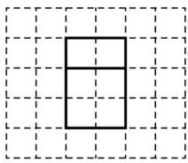
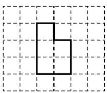
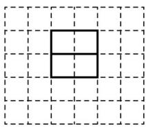

<!-- question-source:start -->
3. 如图，网格纸上绘制的一个零件的三视图，网格小正方形的边长为 1，则该零件的表面积为（）

A. 24 B. 26 C. 28 D. 30

【
<!-- question-source:end -->

![[高中/真题/按年份分类/2023/精品解析_2023年高考全国乙卷数学_文_真题_解析版_/选择题/题目/answers/Q00021622A1.md]]
