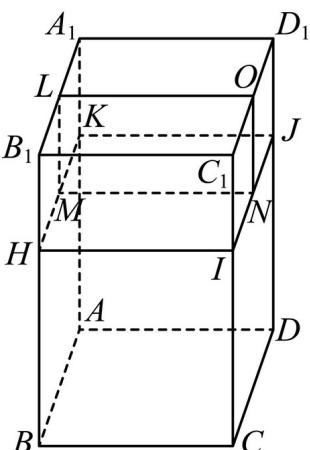

> [!faq]- 精品解析：2023年高考全国乙卷数学(文)真题（解析版）解析
>
> > [!success]- **【答案】** D
>
> > [!note]- **【分析】**
> > 由题意首先由三视图还原空间几何体，然后由所得的空间几何体的结构特征求解其表面积即可.
> > 【
>
> > [!note]- **【解析】**
> > 如图所示，在长方体 $ABCD - A_{1}B_{1}C_{1}D_{1}$ 中，AB = BC = 2， $AA_{1} = 3$ ，
> > 点 H, I, J, K 为所在棱上靠近点 $B_{1}, C_{1}, D_{1}, A_{1}$ 的三等分点，O, L, M, N 为所在棱的中点，
> > 则三视图所对应的几何体为长方体 $ABCD - A_{1}B_{1}C_{1}D_{1}$ 去掉长方体 $ONIC_{1} - LMHB_{1}$ 之后所得的几何体，
> >
> > 
> >
> > 该几何体的表面积和原来的长方体的表面积相比少2个边长为1的正方形，
> >
> > 其表面积为： $2 \times (2 \times 2) + 4 \times (2 \times 3) - 2 \times (1 \times 1) = 30$
> >
> > 故选：D.
