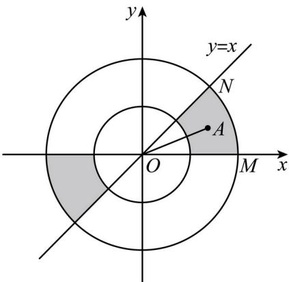

> [!faq]- 精品解析：2023年高考全国乙卷数学(文)真题（解析版）解析
>
> > [!success]- **【答案】** C
>
> > [!note]- **【分析】**
> > 根据题意
>
> > [!note]- **【解析】**
> > 因为区域 $\left\{(x,y) | 1 \leq x^2 + y^2 \leq 4\right\}$ 表示以 $O(0,0)$ 圆心，外圆半径 $R = 2$ ，内圆半径 $r = 1$ 的圆环，则直线 $OA$ 的倾斜角不大于 $\frac{\pi}{4}$ 的部分如阴影所示，在第一象限部分对应的圆心角 $\angle MON = \frac{\pi}{4}$ ，结合对称性可得所求概率 $P = \frac{2 \times \frac{\pi}{4}}{2\pi} = \frac{1}{4}$ .
> >
> > 故选：C.
> >
> > 
