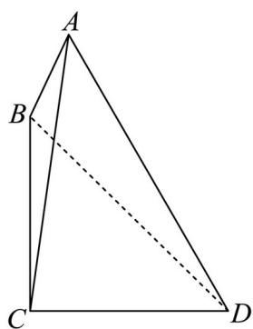

<!-- question-source:start -->
11. 已知点 B 在点 C 正北方向，点 D 在点 C 的正东方向，BC = CD，存在点 A 满足 $\angle BAC = 16.5^{\circ}, \angle DAC = 37^{\circ}$ ，则 $\angle BCA =$ \_\_\_\_（精确到 0.1 度）

<!-- question-source:end -->

![[高中/真题/按年份分类/2024/精品解析_2024年上海夏季高考数学真题_网络回忆版__解析版_/填空题/题目/answers/Q00021185A1.md]]
