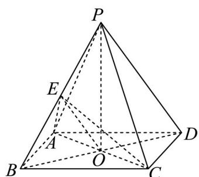

> [!faq]- 精品解析：2024年上海夏季高考数学真题（网络回忆版）（解析版）解析
>
> > [!success]- **【答案】** (1) $12 \pi$ (2) $\frac{\pi}{4}$
>
> > [!note]- **【分析】**
> > （1）根据正四棱锥的数据，先算出直角三角形 $\triangle POA$ 的边长，然后求圆锥的体积；
> > (2) 连接 $EA, EO, EC$ ，可先证 $BE \perp$ 平面 $ACE$ ，根据线面角的定义得出所求角为 $\angle BOE$ ，然后结合题目数量关系求解.
>
> > [!note]- **【解析】**
> > 【小问1详解】
> >
> > 正四棱锥满足且 $PO \perp$ 平面ABCD，由 $AO \subset$ 平面ABCD，则 $PO \perp AO$
> >
> > 又正四棱锥底面 $ABCD$ 是正方形，由 $AD = 3\sqrt{2}$ 可得， $AO = 3$
> >
> > 故 $PO=\sqrt{PA^{2}-AO^{2}}=4$ ，
> >
> > 根据圆锥的定义， $\triangle POA$ 绕 $PO$ 旋转一周形成的几何体是以 $PO$ 为轴， $AO$ 为底面半径的圆锥，
> >
> > 即圆锥的高为 $PO = 4$ ，底面半径为 $AO = 3$
> >
> > 根据圆锥的体积公式，所得圆锥的体积是 $\frac{1}{3} \times \pi \times 3^2 \times 4 = 12\pi$
> >
> > 【小问 2 详解】
> >
> > 连接 $EA,EO,EC$ ，由题意结合正四棱锥的性质可知，每个侧面都是等边三角形，
> >
> > 
> >
> > 由 $E$ 是 $PB$ 中点，则 $AE \perp PB, CE \perp PB$ ，又 $AE \cap CE = E, AE, CE \subset$ 平面 $ACE$ ，
> >
> > 故 $PB \perp$ 平面 $ACE$ ，即 $BE \perp$ 平面 $ACE$ ，又 $BD \cap$ 平面 $ACE = O$ ，
> >
> > 于是直线 BD 与平面 AEC 所成角的大小即为 $\angle BOE$ ，
> >
> > 不妨设 $AP = AD = 6$ ，则 $BO = 3\sqrt{2}, BE = 3$ ， $\sin \angle BOE = \frac{3}{3\sqrt{2}} = \frac{\sqrt{2}}{2}$
> >
> > 又线面角的范围是 $\left[0, \frac{\pi}{2}\right]$ ，
> >
> > 故 $\angle BOE = \frac{\pi}{4}$ . 即为所求.
