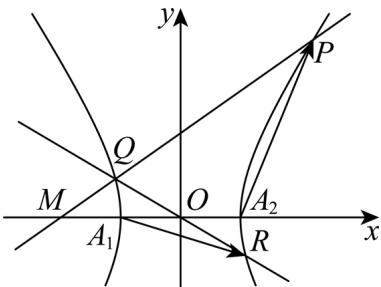

> [!faq]- 精品解析：2024年上海夏季高考数学真题（网络回忆版）（解析版）解析
>
> > [!success]- **【答案】** (1) $b = \sqrt{3}$ (2) $P(2,2\sqrt{2})$ (3) $(0, \sqrt{3}) \cup \left(\sqrt{3}, \frac{\sqrt{30}}{3}\right]$ 【
>
> > [!note]- **【分析】**
> > （1）根据离心率公式计算即可；
>
> > [!note]- **【解析】**
> > 由题意得 $e = \frac{c}{a} = \frac{c}{1} = 2$ ，则 $c = 2$ ， $b = \sqrt{2^2 - 1} = \sqrt{3}$ .
> >
> > 【
> >
> > 小问 2
> >
> > 当 $b=\frac{2\sqrt{6}}{3}$ 时，双曲线 $\Gamma:x^{2}-\frac{y^{2}}{8}=1$ ，其中 $M(-2,0)$ ， $A_{2}(1,0)$ ，
> >
> > 因为 $\triangle MA_{2}P$ 为等腰三角形，则
> >
> > ① 当以 $MA_{2}$ 为底时，显然点 $P$ 在直线 $x = -\frac{1}{2}$ 上，这与点 $P$ 在第一象限矛盾，故舍去；
> >
> > ② 当以 $A_{2}P$ 为底时， $\left|MP\right|=\left|MA_{2}\right|=3$
> >
> > 设，则 $\left\{ \begin{array}{l}x^{2} - \frac{3y^{2}}{8} = 1\\ (x + 2)^{2} + y^{2} = 9 \end{array} \right.$ ，联立解得 $\left\{ \begin{array}{l}x = -\frac{23}{11}\\ y = -\frac{8\sqrt{17}}{11} \end{array} \right.$ 或 $\left\{ \begin{array}{l}x = -\frac{23}{11}\\ y = \frac{8\sqrt{17}}{11} \end{array} \right.$ 或 $\left\{ \begin{array}{l}x = 1,\\ y = 0 \end{array} \right.$
> >
> > 因为点 $P$ 在第一象限，显然以上均不合题意，舍去；
> >
> > （或者由双曲线性质知 $\left|MP\right|>\left|MA_{2}\right|$ ，矛盾，舍去）；
> >
> > ③ 当以 $MP$ 为底时， $\left|A_{2}P\right| = \left|MA_{2}\right| = 3$ ，设 $P(x_0, y_0)$ ，其中 $x_0 > 0, y_0 > 0$
> >
> > 则有 $\left\{ \begin{array}{l} (x_0 - 1)^2 + y_0^2 = 9 \\ x_0^2 - \frac{y_0^2}{8} = 1 \\ \overline{3} \end{array} \right.$ ，解得 $\left\{ \begin{array}{ll} x_0 = 2 & \text{即} \\ y_0 = 2\sqrt{2} & P(2,2\sqrt{2}) \end{array} \right.$ .
> >
> > 综上所述： $P(2,2\sqrt{2})$
> >
> > 小问3
> >
> > 由题知 $A_{1}(-1,0)$ , $A_{2}(1,0)$ ,
> >
> > 当直线 $l$ 的斜率为0时，此时 $A_{1}R\cdot A_{2}P = 0$ ，不合题意，则 $k_{l}\neq 0$
> >
> > 则设直线 $l: x = my - 2$ ，
> >
> > 设点 $P(x_{1},y_{1}),Q(x_{2},y_{2})$ ，根据 $OQ$ 延长线交双曲线 $\Gamma$ 于点 $R$
> >
> > 根据双曲线对称性知 $R(-x_{2}, -y_{2})$ ,
> >
> > 联立有 $\left\{\begin{aligned}x&=my-2\\ x^{2}-\frac{y^{2}}{b^{2}}&=1\end{aligned}\right.\Rightarrow\left(b^{2}m^{2}-1\right)y^{2}-4b^{2}my+3b^{2}&=0$
> >
> > 显然二次项系数 $b^{2}m^{2} - 1 \neq 0$
> >
> > 其中 $\Delta = (-4mb^2)^2 - 4(b^2m^2 - 1)3b^2 = 4b^4m^2 + 12b^2 > 0$
> >
> > $y_{1} + y_{2} = \frac{4b^{2}m}{b^{2}m^{2} - 1}$ ①， $y_{1}y_{2} = \frac{3b^{2}}{b^{2}m^{2} - 1}$ ②，
> >
> > 
> >
> > $A_{1}R = (-x_{2} + 1, - y_{2}), A_{2}P = (x_{1} - 1, y_{1})$
> >
> > 则 $A_{1}R\cdot A_{2}P = (-x_{2} + 1)(x_{1} - 1) - y_{1}y_{2} = 1$ ，因为 $P(x_{1},y_{1}),Q(x_{2},y_{2})$ 在直线 $l$ 上，
> >
> > 则 $x_{1} = my_{1} - 2$ ， $x_{2} = my_{2} - 2$
> >
> > 即 $-(my_{2}-3)(my_{1}-3)-y_{1}y_{2}=1$ ，即 $y_{1}y_{2}(m^{2}+1)-(y_{1}+y_{2})3m+10=0$
> >
> > 将①②代入有 $(m^{2}+1)\cdot\frac{3b^{2}}{b^{2}m^{2}-1}-3m\cdot\frac{4b^{2}m}{b^{2}m^{2}-1}+10=0$ ，
> >
> > 即 $3b^{2}(m^{2} + 1) - 3m \cdot 4b^{2}m + 10(b^{2}m^{2} - 1) = 0$
> >
> > 化简得 $b^{2}m^{2}+3b^{2}-10=0$ ，
> >
> > 所以 $m^{2}=\frac{10}{b^{2}}-3$ ，代入到 $b^{2}m^{2}-1\neq0$ ，得 $b^{2}=10-3b^{2}\neq1$ ，所以 $b^{2}\neq3$ ，
> >
> > 且 $m^2 = \frac{10}{b^2} - 3 \geq 0$ ，解得 $b^2 \leq \frac{10}{3}$ ，又因为 $b > 0$ ，则 $0 < b^2 \leq \frac{10}{3}$ ，
> >
> > 综上知， $b^{2}\in(0,3)\cup\left(3,\frac{10}{3}\right]$ ， $\therefore b\in(0,\sqrt{3})\cup\left(\sqrt{3},\frac{\sqrt{30}}{3}\right]$ .
> >
> > 【点睛】关键点点睛：本题第三问的关键是采用设线法，为了方便运算可设 $l: x = my - 2$ ，将其与双曲线方程联立得到韦达定理式，再写出相关向量，代入计算，要注意排除联立后的方程得二次项系数不为0.
