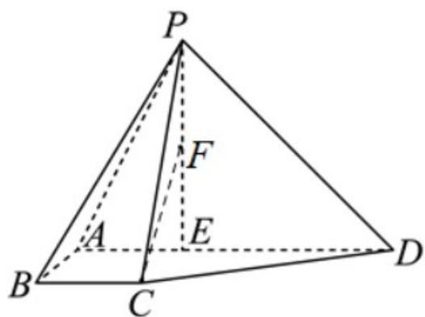

<!-- question-source:start -->
17. 如图，在四棱锥 $P - ABCD$ 中， $BC // AD$ ， $AB = BC = 1$ ， $AD = 3$ ，点 $E$ 在 $AD$ 上，且 $PE \perp AD$ ， $PE = DE = 2$ .

<!-- question-source:end -->

![[高中/真题/按年份分类/2024/精品解析_2024年北京高考数学真题_解析版_/解答题/题目/answers/Q00029338A1.md]]
