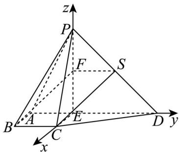

> [!faq]- 精品解析：2024年北京高考数学真题（解析版）解析
>
> > [!success]- **【答案】** （1）证明见
>
> > [!note]- **【分析】**
> > （1）取 $PD$ 的中点为 $S$ ，接 $SF, SC$ ，可证四边形 $SFBC$ 为平行四边形，由线面平行的判定定理
>
> > [!note]- **【解析】**
> > 取 $_{PD}$ 的中点为 $_{S}$ ，接 $_{SF,SC}$ ，则 $SF//ED, SF=\frac{1}{2}ED=1$ ，
> >
> > 而 $ED / / BC, ED = 2BC$ ，故 $SF / / BC, SF = BC$ ，故四边形 $SFBC$ 为平行四边形，
> >
> > 故 $BF \parallel SC$ ，而 $BF \notin$ 平面 $PCD$ ， $SC \subset$ 平面 $PCD$ ，
> >
> > 所以 $BF \parallel$ 平面 PCD.
> >
> > 【
> >
> > 小问 2
> >
> > 
> >
> > 因为 $ED = 2$ ，故 $AE = 1$ ，故 $AE // BC, AE = BC$
> >
> > 故四边形 AECB 为平行四边形，故 CE // AB ，所以 CE ⊥ 平面 PAD ，
> >
> > 而 $PE, ED \subset$ 平面 $PAD$ ，故 $CE \perp PE, CE \perp ED$ ，而 $PE \perp ED$ ，
> >
> > 故建立如图所示的空间直角坐标系，
> >
> > 则 $A(0, -1, 0), B(1, -1, 0), C(1, 0, 0), D(0, 2, 0), P(0, 0, 2)$
> >
> > 则 $PA = (0, -1, -2), PB = (1, -1, -2), PC = (1, 0, -2), PD = (0, 2, -2)$
> >
> > 设平面 $PAB$ 的法向量为 $m = (x, y, z)$ ,
> >
> > 则由 $\left\{\begin{aligned}&m\cdot PA=0\\ &m\cdot PB=0\end{aligned}\right.$ 可得 $\left\{\begin{aligned}-y-2z=0\\ x-y-2z=0\end{aligned}\right.$ ，取 $m=(0,-2,1)$
> >
> > 设平面 PCD 的法向量为 $n=(a,b,c)$ ,
> >
> > 则由 $\left\{\begin{aligned}n&\cdot PC=0\\ n&\cdot PD=0\end{aligned}\right.$ 可得 $\left\{\begin{aligned}a-2b=0\\ 2b-2c=0\end{aligned}\right.$ ，取 $n=(2,1,1)$ ，
> >
> > 故 $\cos m, n = \frac{-1}{\sqrt{5} \times \sqrt{6}} = -\frac{\sqrt{30}}{30}$ ,
> >
> > 故平面 $PAB$ 与平面 $PCD$ 夹角的余弦值为 $\frac{\sqrt{30}}{30}$
