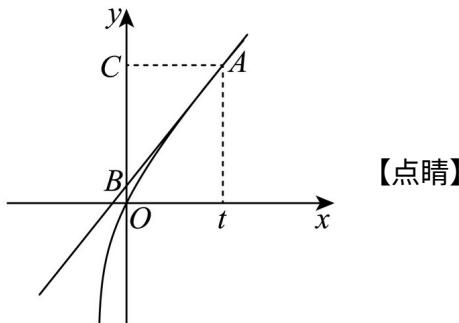

> [!faq]- 精品解析：2024年北京高考数学真题（解析版）解析
>
> > [!success]- **【答案】** （1）单调递减区间为 $(-1,0)$ ，单调递增区间为 $(0, +\infty)$ . (2) 证明见
>
> > [!note]- **【分析】**
> > （1）直接代入 $k = -1$ ，再利用导数研究其单调性即可；
>
> > [!note]- **【解析】**
> > $$
> > f (x) = x - \ln (1 + x), f ^ {\prime} (x) = 1 - \frac {1}{1 + x} = \frac {x}{1 + x} (x > - 1),
> > $$
> >
> > 当 $x \in (-1,0)$ 时， $f'(x) < 0$ ；当 $x \in (0, +\infty)$ ， $f(q(x)) > 0$ ；
> >
> > $\therefore f(x)$ 在 $(-1,0)$ 上单调递减，在 $(0, +\infty)$ 上单调递增.
> >
> > 则 $f(x)$ 的单调递减区间为 $(-1,0)$ ，单调递增区间为 $(0, +\infty)$ .
> >
> > 【
> >
> > 小问 2
> >
> > $f^{\prime}(x) = 1 + \frac{k}{1 + x}$ ，切线 $l$ 的斜率为 $1 + \frac{k}{1 + t}$
> >
> > 则切线方程为 $y - f(t) = \left(1 + \frac{k}{1 + t}\right)(x - t)(t > 0)$ ，
> >
> > 将 $(0,0)$ 代入则 $-f(t) = -t\left(1 + \frac{k}{1 + t}\right), f(t) = t\left(1 + \frac{k}{1 + t}\right)$ ，
> >
> > 即 $t + k\ln (1 + t) = t + t\frac{k}{1 + t}$ ，则 $\ln (1 + t) = \frac{t}{1 + t},\ln (1 + t) - \frac{t}{1 + t} = 0$
> >
> > $$
> > \text { 令 } F (t) = \ln (1 + t) - \frac {t}{1 + t},
> > $$
> >
> > 假设 $l$ 过 $(0,0)$ ，则 $F(t)$ 在 $t \in (0, +\infty)$ 存在零点.
> >
> > $F^{\prime}(t) = \frac{1}{1 + t} -\frac{1 + t - t}{(1 + t)^{2}} = \frac{t}{(1 + t)^{2}} >0$ ，∴ $F(t)$ 在 $(0, + \infty)$ 上单调递增， $F(t) > F(0) = 0$
> >
> > $\therefore F(t)$ 在 $(0, +\infty)$ 无零点，∴与假设矛盾，故直线 $l$ 不过 $(0, 0)$ .
> >
> > 【
> >
> > 小问3
> >
> > 时， $f(x) = x + \ln (1 + x), f'(x) = 1 + \frac{1}{1 + x} = \frac{x + 2}{1 + x} >0.$
> >
> > $S_{\triangle ACO}=\frac{1}{2}tf(t)$ ，设 $_{l}$ 与 $_{y}$ 轴交点 $_{B}$ 为 $(0,q)$ ，
> >
> > $t > 0$ 时，若 $q < 0$ ，则此时 $l$ 与 $f(x)$ 必有交点，与切线定义矛盾.
> >
> > 由（2）知 $q \neq 0$ 。所以 $q > 0$ ，
> >
> > 则切线 $l$ 的方程为 $y - t - \ln (t + 1) = \left(1 + \frac{1}{1 + t}\right)(x - t)$ ，
> >
> > 令 $x = 0$ ，则 $y = q = y = \ln (1 + t) - \frac{t}{t + 1}$
> >
> > $\because 2S_{\triangle ACO} = 15S_{ABO}$ ，则 $2tf(t) = 15t\left[\ln (1 + t) - \frac{t}{t + 1}\right]$
> >
> > $\therefore 13\ln (1 + t) - 2t - 15\frac{t}{1 + t} = 0$ ，记 $h(t) = 13\ln (1 + t) - 2t - \frac{15t}{1 + t}(t > 0)$
> >
> > ∴满足条件的 A 有几个即 $h(t)$ 有几个零点.
> >
> > $$
> > h ^ {\prime} (t) = \frac {1 3}{1 + t} - 2 - \frac {1 5}{(t + 1) ^ {2}} = \frac {1 3 t + 1 3 - 2 (t ^ {2} + 2 t + 1) - 1 5}{(t + 1) ^ {2}} = \frac {2 t ^ {2} + 9 t - 4}{(t + 1) ^ {2}} = \frac {(- 2 t + 1) (t - 4)}{(t + 1) ^ {2}},
> > $$
> >
> > 当 $t \in \left(0, \frac{1}{2}\right)$ 时， $h'(t) < 0$ ，此时 $h(t)$ 单调递减；
> >
> > 当 $t \in \left(\frac{1}{2}, 4\right)$ 时， $h'(t) > 0$ ，此时 $h(t)$ 单调递增；
> >
> > 当 $t\in(4,+\infty)$ 时， $h'(t)<0$ ，此时 $h(t)$ 单调递减；
> >
> > 因为 $h(0) = 0, h\left(\frac{1}{2}\right) \langle 0, h(4) = 13 \ln 5 - 20 \rangle 13 \times 1.6 - 20 = 0.8 > 0$
> >
> > $$
> > h (2 4) = 1 3 \ln 2 5 - 4 8 - \frac {1 5 \times 2 4}{2 5} = 2 6 \ln 5 - 4 8 - \frac {7 2}{5} <   2 6 \times 1. 6 1 - 4 8 - \frac {7 2}{5} = - 2 0. 5 4 <   0,
> > $$
> >
> > 所以由零点存在性定理及 $h(t)$ 的单调性， $h(t)$ 在 $\left(\frac{1}{2}, 4\right)$ 上必有一个零点，在 $(4, 24)$ 上必有一个零点，综上所述， $h(t)$ 有两个零点，即满足 $2S_{ACO} = 15S_{ABO}$ 的 A 有两个.
> >
> > 
> >
> > 关键点点睛：本题第二问的关键是采用的是反证法，转化为研究函数零点问题.
