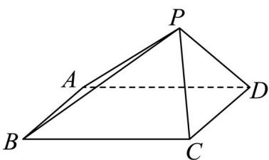

<!-- question-source:start -->
8. 如图，在四棱锥 $P - ABCD$ 中，底面 $ABCD$ 是边长为 4 的正方形， $PA = PB = 4$ ， $PC = PD = 2\sqrt{2}$ ，该棱锥的高为（）.

A. 1 B. 2 C. $\sqrt{2}$ D. $\sqrt{3}$
<!-- question-source:end -->

![[高中/真题/按年份分类/2024/精品解析_2024年北京高考数学真题_解析版_/选择题/题目/answers/Q00030740A1.md]]
