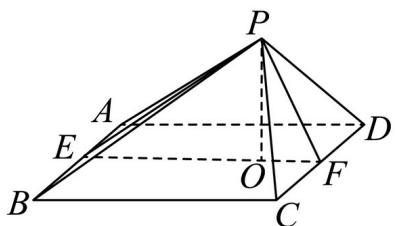

> [!faq]- 精品解析：2024年北京高考数学真题（解析版）解析
>
> > [!success]- **【答案】** D
>
> > [!note]- **【分析】**
> > 取点作辅助线，根据题意分析可知平面 $PEF \perp$ 平面ABCD，可知 $PO \perp$ 平面ABCD，利用等体积法求点到面的距离.
>
> > [!note]- **【解析】**
> > 如图，底面 ABCD 为正方形，
> >
> > 当相邻的棱长相等时，不妨设 $PA = PB = AB = 4, PC = PD = 2\sqrt{2}$
> >
> > 
> >
> > 分别取 $AB, CD$ 的中点 $E, F$ ，连接 $PE, PF, EF$ ，
> >
> > 则 $PE \perp AB, EF \perp AB$ ，且 $PE \cap EF = E$ ， $PE, EF \subset$ 平面 $PEF$ ，
> >
> > 可知 $AB \perp$ 平面 PEF，且 $AB \subset$ 平面 ABCD，
> >
> > 所以平面 $PEF \perp$ 平面 $ABCD$ ,
> >
> > 过 P 作 EF 的垂线，垂足为 O，即 $PO \perp EF$ ，
> >
> > 由平面 $PEF \cap$ 平面 $ABCD = EF$ ， $PO \subset$ 平面 $PEF$ ，
> >
> > 所以 $PO \perp$ 平面 ABCD，
> >
> > 由题意可得： $PE = 2\sqrt{3}, PF = 2, EF = 4$ ，则 $PE^2 + PF^2 = EF^2$ ，即 $PE \perp PF$
> >
> > 则 $\frac{1}{2} PE\cdot PF = \frac{1}{2} PO\cdot EF$ ，可得 $PO = \frac{PE\cdot PF}{EF} = \sqrt{3}$
> >
> > 所以四棱锥的高为 $\sqrt{3}$
> >
> > 当相对的棱长相等时，不妨设 PA = PC = 4 ， PB = PD = 2 $\sqrt{2}$ ，
> >
> > 因为 $BD = 4\sqrt{2} = PB + PD$ ，此时不能形成三角形 $PBD$ ，与题意不符，这样情况不存在.
> >
> > 故选：D.
