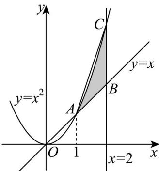

> [!faq]- 精品解析：2024年北京高考数学真题（解析版）解析
>
> > [!success]- **【答案】** C
>
> > [!note]- **【分析】**
> > 先以 t 为变量，分析可知所求集合表示的图形即为平面区域 $\left\{\begin{aligned}y &\leq x^{2}\\ y &\geq x\\ 1 &\leq x &\leq 2\end{aligned}\right.$ ，结合图形分析求解即可.
>
> > [!note]- **【解析】**
> > 对任意给定 $x \in [1, 2]$ ，则 $x^{2} - x = x(x - 1) \geq 0$ ，且 $t \in [0, 1]$ ，
> > 可知 $x \leq x + t(x^{2} - x) \leq x + x^{2} - x = x^{2}$ ，即 $x \leq y \leq x^{2}$ ，
> > 再结合 x 的任意性，所以所求集合表示的图形即为平面区域 $\left\{\begin{aligned}y &\leq x^{2}\\ y &\geq x\\ 1 &\leq x &\leq 2\end{aligned}\right.$ 如图阴影部分所示，其中 $A(1,1), B(2,2), C(2,4)$ ,
> >
> > 
> >
> > 可知任意两点间距离最大值 $d = |AC| = \sqrt{10}$
> >
> > 阴影部分面积 $S < S_{\triangle ABC} = \frac{1}{2} \times 1 \times 2 = 1$ .
> >
> > 故选：C.
> >
> > 【点睛】方法点睛：数形结合的重点是“以形助数”，在解题时要注意培养这种思想意识，做到心中有图，见数想图，以开拓自己的思维。使用数形结合法的前提是题目中的条件有明确的几何意义，解题时要准确把握条件、结论与几何图形的对应关系，准确利用几何图形中的相关结论求解。
> >
> > ## 第二部分（非选择题 共 110 分）
> >
> > ##
