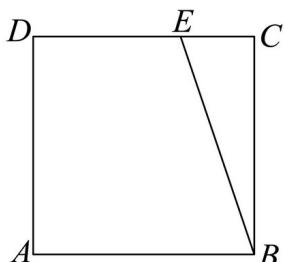

<!-- question-source:start -->
14. 在边长为 1 的正方形 ABCD 中，点 E 为线段 CD 的三等分点， $CE=\frac{1}{2}DE, BE=\lambda BA+\mu BC$ ，则

$\lambda + \mu =$ \_\_\_\_；若 $F$ 为线段 $BE$ 上的动点， $G$ 为 $AF$ 中点，则 $AF \cdot DG$ 的最小值为\_\_\_\_。

【
<!-- question-source:end -->

![[高中/真题/按年份分类/2024/精品解析_2024年天津高考数学真题_解析版_/填空题/题目/answers/Q00022640A1.md]]
