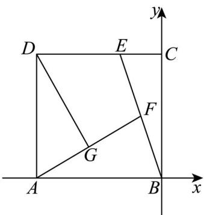

> [!faq]- 精品解析：2024年天津高考数学真题（解析版）解析
>
> > [!success]- **【答案】** ①. $\frac{4}{3}$ ②. $-\frac{5}{18}$ 【
>
> > [!note]- **【分析】**
> > 解法一：以 $\left\{BA, BC\right\}$ 为基底向量，根据向量的线性运算求 $_{BE}$ ，即可得 $\lambda + \mu$ ，设 $\frac{\omega}{BF} = k\frac{\omega}{BE}$ ，
>
> > [!note]- **【解析】**
> > 解法一：因为 $CE = \frac{1}{2} DE$ ，即 $CE = \frac{2}{3} BA$ ，则 $BE = BC + CE = \frac{1}{3} BA + BC$
> >
> > 可得 $\lambda=\frac{1}{3},\mu=1$ ，所以 $\lambda+\mu=\frac{4}{3}$ ;
> >
> > 由题意可知： $\left|BC\right|=\left|BA\right|=1,BA\cdot BC=0$
> >
> > 因为 $F$ 为线段 $BE$ 上的动点，设 $BF = kBE = \frac{1}{3} kBA + kBC, k \in [0,1]$ ，
> >
> > $$
> > A F = A B + B F = A B + k B E = \left(\frac {1}{3} k - 1\right) B A + k B C
> > $$
> >
> > 又因为 $G$ 为 $AF$ 中点，则 $DG = DA + AG = -BC + \frac{1}{2} AF = \frac{1}{2}\left(\frac{1}{3} k - 1\right)BA + \left(\frac{1}{2} k - 1\right)BC,$
> >
> > $$
> > A F \cdot D G = \left[ \left(\frac {1}{3} k - 1\right) B A + k B C \right] \cdot \left[ \frac {1}{2} \left(\frac {1}{3} k - 1\right) B A + \left(\frac {1}{2} k - 1\right) B C \right]
> > $$
> >
> > $$
> > = \frac {1}{2} \left(\frac {1}{3} k - 1\right) ^ {2} + k \left(\frac {1}{2} k - 1\right) = \frac {5}{9} \left(k - \frac {6}{5}\right) ^ {2} - \frac {3}{1 0},
> > $$
> >
> > 又因为 $k \in [0,1]$ ，可知：当 $k = 1$ 时， $AF \cdot DG$ 取到最小值 $-\frac{5}{18}$ ；
> >
> > 解法二：以 B 为坐标原点建立平面直角坐标系，如图所示，
> >
> > 
> >
> > 则 $A(-1,0), B(0,0), C(0,1), D(-1,1), E\left(-\frac{1}{3}, 1\right)$ ,
> >
> > 可得 $BA = (-1,0), BC = (0,1), BE = \left(-\frac{1}{3}, 1\right)$ ,
> >
> > 因为 $BE = \lambda BA + \mu BC = (-\lambda, \mu)$ ，则 $\left\{ \begin{array}{l} -\lambda = -\frac{1}{3} \\ \mu = 1 \end{array} \right.$ ，所以 $\lambda + \mu = \frac{4}{3}$ ；
> >
> > 因为点 $F$ 在线段 $BE:y = -3x,x\in \left[-\frac{1}{3},0\right]$ 上，设 $F(a, - 3a),a\in \left[-\frac{1}{3},0\right]$
> >
> > 且 $G$ 为 $AF$ 中点，则 $G\left(\frac{a - 1}{2}, - \frac{3}{2} a\right)$
> >
> > 可得 $AF = (a + 1, -3a), DG = \left(\frac{a + 1}{2}, -\frac{3}{2} a - 1\right)$ ,
> >
> > 则 $AF \cdot DG = \frac{(a + 1)^2}{2} + (-3a)\left(-\frac{3}{2} a - 1\right) = 5\left(a + \frac{2}{5}\right)^2 - \frac{3}{10}$ ,
> >
> > 且 $a \in \left[-\frac{1}{3}, 0\right]$ ，所以当 $a = -\frac{1}{3}$ 时， $AF \cdot DG$ 取到最小值为 $-\frac{5}{18}$ ；
> >
> > 故
