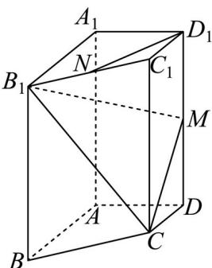

<!-- question-source:start -->
17. 已知四棱柱 $ABCD - A_{1}B_{1}C_{1}D_{1}$ 中，底面 $ABCD$ 为梯形， $AB // CD$ ， $A_{1}A \perp$ 平面 $ABCD$

$AD \perp AB$ ，其中 $AB = AA_{1} = 2, AD = DC = 1$ 。 $N$ 是 $B_{1}C_{1}$ 的中点， $M$ 是 $DD_{1}$ 的中点。

<!-- question-source:end -->

![[高中/真题/按年份分类/2024/精品解析_2024年天津高考数学真题_解析版_/解答题/题目/answers/Q00029347A1.md]]
