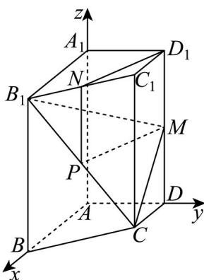

> [!faq]- 精品解析：2024年天津高考数学真题（解析版）解析
>
> > [!success]- **【答案】** （1）证明见
>
> > [!note]- **【分析】**
> > （1）取 $CB_{1}$ 中点 $P$ ，连接 $NP$ ， $MP$ ，借助中位线的性质与平行四边形性质定理可得 $D_{1}N//MP$ ，结合线面平行判定定理即可得证；
>
> > [!note]- **【解析】**
> > 取 $CB_{1}$ 中点 $P$ ，连接 $NP$ ， $MP$ ，
> >
> > 由 $N$ 是 $B_{1}C_{1}$ 的中点，故 $NP//CC_{1}$ ，且 $NP = \frac{1}{2} CC_{1}$ ，
> >
> > 由 $_{M}$ 是 $DD_{1}$ 的中点，故 $D_{1}M=\frac{1}{2}DD_{1}=\frac{1}{2}CC_{1}$ ，且 $D_{1}M//CC_{1}$ ，
> >
> > 则有 $D_{1}M \parallel NP$ 、 $D_{1}M = NP$ ，
> >
> > 故四边形 $D_{1}MPN$ 是平行四边形，故 $D_{1}N//MP$ ，
> >
> > 又 $MP \subset$ 平面 $CB_{1}M$ ， $D_{1}N \notin$ 平面 $CB_{1}M$
> >
> > 故 $D_{1}N//$ 平面 $CB_{1}M$ ;
> >
> > 【
> >
> > 小问 2
> >
> > 以 A 为原点建立如图所示空间直角坐标系，
> >
> > 
> >
> > 有 $A(0,0,0)$ 、 $B(2,0,0)$ 、 $B_{1}(2,0,2)$ 、 $M(0,1,1)$ 、 $C(1,1,0)$ 、 $C_1(1,1,2)$
> >
> > 则有 $CB_{1} = (1, - 1,2)$ 、 $CM = (-1,0,1)$ 、 $BB_{1} = (0,0,2)$
> >
> > 设平面 $CB_{1}M$ 与平面 $BB_{1}CC_{1}$ 的法向量分别为 $m = (x_{1},y_{1},z_{1})$ 、 $n = (x_2,y_2,z_2)$
> >
> > 则有 $\left\{ \begin{array}{l} m \cdot CB_{1} = x_{1} - y_{1} + 2z_{1} = 0 \\ m \cdot CM = -x_{1} + z_{1} = 0 \end{array} \right.$ ， $\left\{ \begin{array}{l} n \cdot CB_{1} = x_{2} - y_{2} + 2z_{2} = 0 \\ n \cdot BB_{1} = 2z_{2} = 0 \end{array} \right.$ ，
> >
> > 分别取 $x_{1} = x_{2} = 1$ ，则有 $y_{1} = 3$ 、 $z_{1} = 1$ 、 $y_{2} = 1$ ， $z_{2} = 0$
> >
> > 即 $m=(1,3,1)$ 、 $n=(1,1,0)$ ,
> >
> > 则 $\cos m, n = \frac{m \cdot n}{|m| \cdot |n|} = \frac{1 + 3}{\sqrt{1 + 9 + 1} \cdot \sqrt{1 + 1}} = \frac{2\sqrt{22}}{11}$ ,
> >
> > 故平面 $CB_{1}M$ 与平面 $BB_{1}CC_{1}$ 的夹角余弦值为 $\frac{2\sqrt{22}}{11}$
> >
> > 【
> >
> > 小问3
> >
> > 由 $BB_{1} = (0,0,2)$ ，平面 $CB_{1}M$ 的法向量为 $m = (1,3,1)$
> >
> > 则有 $\frac{\left|BB_1\cdot m\right|}{\left|m\right|} = \frac{2}{\sqrt{1 + 9 + 1}} = \frac{2\sqrt{11}}{11},$
> >
> > 即点 $_{B}$ 到平面 $CB_{1}M$ 的距离为 $\frac{2\sqrt{11}}{11}$ .
