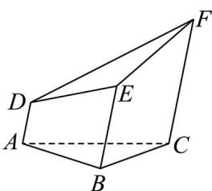

<!-- question-source:start -->
9. 一个五面体 $ABC - DEF$ 。已知 $AD \parallel BE \parallel CF$ ，且两两之间距离为 1。并已知

$AD = 1, BE = 2, CF = 3$ ．则该五面体的体积为（）

A $\frac{\sqrt{3}}{6}$ B. $\frac{3\sqrt{3}}{4} +\frac{1}{2}$ C. $\frac{\sqrt{3}}{2}$ D. $\frac{3\sqrt{3}}{4} -\frac{1}{2}$

【
<!-- question-source:end -->

![[高中/真题/按年份分类/2024/精品解析_2024年天津高考数学真题_解析版_/选择题/题目/answers/Q00022635A1.md]]
