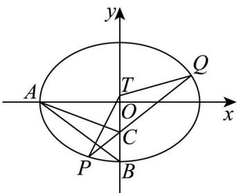

> [!faq]- 精品解析：2024年天津高考数学真题（解析版）解析
>
> > [!success]- **【答案】** 详见解析
>
> > [!note]- **【分析】**
> > 本题未单列分析。
>
> > [!note]- **【解析】**
> > 因为椭圆的离心率为 $e = \frac{1}{2}$ ，故 $a = 2c$ ， $b = \sqrt{3} c$ ，其中 $c$ 为半焦距，
> >
> > 所以 $A(-2c,0)$ , $B(0,-\sqrt{3}c)$ , $C\left(0,-\frac{\sqrt{3}c}{2}\right)$ ，故 $S_{\triangle ABC}=\frac{1}{2}\times2c\times\frac{\sqrt{3}}{2}c=\frac{3\sqrt{3}}{2}$ ,
> >
> > 故 $c = \sqrt{3}$ ，所以 $a = 2\sqrt{3}$ ， $b = 3$ ，故椭圆方程为： $\frac{x^2}{12} +\frac{y^2}{9} = 1.$
> >
> > 【
> >
> > 小问 2
> >
> > 
> >
> > 若过点 $\left(0, -\frac{3}{2}\right)$ 的动直线的斜率存在，则可设该直线方程为： $y = kx - \frac{3}{2}$
> >
> > 设 $P(x_{1},y_{1}),Q(x_{2},y_{2}),T(0,t)$ ,
> >
> > 由 $\left\{ \begin{array}{l} 3x^{2} + 4y^{2} = 36 \\ y = kx - \frac{3}{2} \end{array} \right.$ 可得 $(3 + 4k^{2})x^{2} - 12kx - 27 = 0$ 故 $\Delta = 144k^{2} + 108(3 + 4k^{2}) = 324 + 576k^{2} > 0$ 且 $x_{1} + x_{2} = \frac{12k}{3 + 4k^{2}}, x_{1}x_{2} = -\frac{27}{3 + 4k^{2}}$
> >
> > 而 $TP=(x_{1},y_{1}-t),TQ=(x_{2},y_{2}-t)$ ,
> >
> > $$
> > \text { 故 } T P \cdot T Q = x _ {1} x _ {2} + (y _ {1} - t) (y _ {2} - t) = x _ {1} x _ {2} + \left(k x _ {1} - \frac {3}{2} - t\right) \left(k x _ {2} - \frac {3}{2} - t\right)
> > $$
> >
> > $$
> > = \left(1 + k ^ {2}\right) x _ {1} x _ {2} - k \left(\frac {3}{2} + t\right) \left(x _ {1} + x _ {2}\right) + \left(\frac {3}{2} + t\right) ^ {2}
> > $$
> >
> > $$
> > = (1 + k ^ {2}) \times \left(- \frac {2 7}{3 + 4 k ^ {2}}\right) - k \left(\frac {3}{2} + t\right) \times \frac {1 2 k}{3 + 4 k ^ {2}} + \left(\frac {3}{2} + t\right) ^ {2}
> > $$
> >
> > $$
> > = \frac {- 2 7 k ^ {2} - 2 7 - 1 8 k ^ {2} - 1 2 k ^ {2} t + 3 \left(\frac {3}{2} + t\right) ^ {2} + (3 + 2 t) ^ {2} k ^ {2}}{3 + 4 k ^ {2}}
> > $$
> >
> > $$
> > = \frac {\left[ (3 + 2 t) ^ {2} - 1 2 t - 4 5 \right] k ^ {2} + 3 \left(\frac {3}{2} + t\right) ^ {2} - 2 7}{3 + 4 k ^ {2}},
> > $$
> >
> > 因为 恒成立，故 $\left\{\begin{aligned}&(3+2t)^{2}-12t-45\leq0\\ &3\left(\frac{3}{2}+t\right)^{2}-27\leq0\end{aligned}\right.$ ，解得 $-3\leq t\leq\frac{3}{2}$
> >
> > 若过点 $\left(0, -\frac{3}{2}\right)$ 的动直线的斜率不存在，则 $P(0,3), Q(0,-3)$ 或 $P(0,-3), Q(0,3)$ ，
> >
> > 此时需 $-3 \leq t \leq 3$ ，两者结合可得 $-3 \leq t \leq \frac{3}{2}$ .
> >
> > 综上，存在 $T(0,t)\left(-3\leq t\leq \frac{3}{2}\right)$ ，使得 $TP\cdot TQ\leq 0$ 恒成立.
> >
> > 【点睛】思路点睛：圆锥曲线中的范围问题，往往需要用合适的参数表示目标代数式，表示过程中需要借助韦达定理，此时注意直线方程的合理假设.
