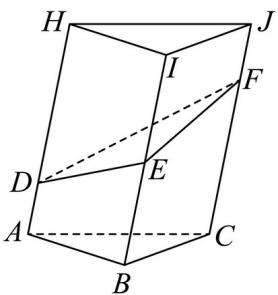

> [!faq]- 精品解析：2024年天津高考数学真题（解析版）解析
>
> > [!success]- **【答案】** C
>
> > [!note]- **【分析】**
> > 采用补形法，补成一个棱柱，求出其直截面，再利用体积公式即可.
>
> > [!note]- **【解析】**
> > $$
> > H I J - L M N
> > $$
> >
> > $$
> > A B C - D E F
> > $$
> >
> > 使得 D, N; E, M; F, L 重合,
> >
> > 因为 $AD \parallel BE \parallel CF$ ，且两两之间距离为1． $AD = 1, BE = 2, CF = 3$ ，
> >
> > 则形成的新组合体为一个三棱柱，
> >
> > 该三棱柱的直截面（与侧棱垂直的截面）为边长为1的等边三角形，侧棱长为 $1+3=2+2=3+1=4$ ， $V_{ABC-DEF}=\frac{1}{2}V_{ABC-HIJ}=\frac{1}{2}\times\frac{1}{2}\times1\times1\times\frac{\sqrt{3}}{2}\times4=\frac{\sqrt{3}}{2}.$
> >
> > 故选：C.
> >
> > 
> >
> > 第Ⅱ卷
> >
> > ## 注意事项：
> >
> > 1. 用黑色墨水的钢笔或签字笔将答案写在答题卡上。
