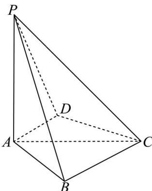

<!-- question-source:start -->
17. 如图，四棱锥 P - ABCD 中， $PA \perp$ 底面 ABCD， $PA = AC = 2$ ， $BC = 1, AB = \sqrt{3}$

<!-- question-source:end -->

![[高中/真题/按年份分类/2024/精品解析_2024年新课标全国Ⅰ卷数学真题_解析版_/解答题/题目/answers/Q00029353A1.md]]
