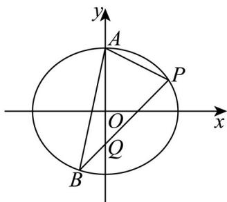

> [!faq]- 精品解析：2024年新课标全国Ⅰ卷数学真题（解析版）解析
>
> > [!success]- **【答案】** (1) $\frac{1}{2}$ (2) 直线 $l$ 的方程为 $3x - 2y - 6 = 0$ 或 $x - 2y = 0$ . 【
>
> > [!note]- **【分析】**
> > （1）代入两点得到关于 $a, b$ 的方程，解出即可；
>
> > [!note]- **【解析】**
> > 由题意得 $\left\{ \begin{array}{c}b = 3\\ \frac{9}{a^2} +\frac{\overline{4}}{b^2} = 1 \end{array} \right.$ ，解得 $\left\{ \begin{array}{l}b^{2} = 9\\ a^{2} = 12 \end{array} \right.,$
> >
> > 所以 $e=\sqrt{1-\frac{b^{2}}{a^{2}}}=\sqrt{1-\frac{9}{12}}=\frac{1}{2}.$
> >
> > 【
> >
> > 小问 2
> >
> > 法一： $k_{AP} = \frac{3 - \frac{3}{2}}{0 - 3} = -\frac{1}{2}$ ，则直线 $_{AP}$ 的方程为 $y = -\frac{1}{2} x + 3$ ，即 $x + 2y - 6 = 0$
> >
> > $\left|AP\right| = \sqrt{(0 - 3)^2 + \left(3 - \frac{3}{2}\right)^2} = \frac{3\sqrt{5}}{2}$ ，由（1）知 $C: \frac{x^2}{12} + \frac{y^2}{9} = 1$ ，
> >
> > 设点到直线的距离为，则 $d = \frac{2\times 9}{\frac{3\sqrt{5}}{2}} = \frac{12\sqrt{5}}{5}$
> >
> > 则将直线 $_{AP}$ 沿着与 $_{AP}$ 垂直的方向平移 $\frac{12\sqrt{5}}{5}$ 单位即可，
> >
> > 此时该平行线与椭圆的交点即为点 B，
> >
> > 设该平行线的方程为： $x + 2y + C = 0$
> >
> > 则 $\frac{|C + 6|}{\sqrt{5}} = \frac{12\sqrt{5}}{5}$ ，解得 $C = 6$ 或 $C = -18$ ，
> >
> > 当 时，联立 $\left\{ \begin{array}{l} \frac{x^2}{12} + \frac{y^2}{9} = 1 \\ x + 2y + 6 = 0 \end{array} \right.$ ，解得 $\left\{ \begin{array}{l} x = 0 \\ y = -3 \end{array} \right.$ 或 $\left\{ \begin{array}{l} x = -3 \\ y = -\frac{3}{2} \end{array} \right.$ ，
> >
> > 即 $B(0, -3)$ 或 $\left(-3, -\frac{3}{2}\right)$ ,
> >
> > 当 $B(0, -3)$ 时，此时 $k_{l} = \frac{3}{2}$ ，直线 $l$ 的方程为 $y = \frac{3}{2} x - 3$ ，即 $3x - 2y - 6 = 0$
> >
> > 当 $B\left(-3, - \frac{3}{2}\right)$ 时，此时 $k_{l} = \frac{1}{2}$ ，直线 $l$ 的方程为 $y = \frac{1}{2} x$ ，即 $x - 2y = 0$
> >
> > 当时，联立 $\left\{ \begin{array}{l} \frac{x^2}{12} + \frac{y^2}{9} = 1 \\ x + 2y - 18 = 0 \end{array} \right.$ 得 $2y^{2} - 27y + 117 = 0$
> >
> > $\Delta = 27^{2} - 4 \times 2 \times 117 = -207 < 0$ ，此时该直线与椭圆无交点.
> >
> > 综上直线 $l$ 的方程为 $3x - 2y - 6 = 0$ 或 $x - 2y = 0$
> >
> > 法二：同法一得到直线 $AP$ 的方程为 $x + 2y - 6 = 0$
> >
> > 点 $_{B}$ 到直线 $_{AP}$ 的距离 $d=\frac{12\sqrt{5}}{5}$ ,
> >
> > 设，则 $\left\{ \begin{array}{l} \frac{\left|x_{0} + 2y_{0} - 6\right|}{\sqrt{5}} = \frac{12\sqrt{5}}{5}\\ \frac{x_0^2}{12} +\frac{y_0^2}{9} = 1 \end{array} \right.$ ，解得 $\left\{ \begin{array}{ll} x_0 = -3\\ y_0 = -\frac{3}{2} \end{array} \right.$ 或 $\left\{ \begin{array}{ll} x_0 = 0,\\ y_0 = -3 \end{array} \right.$
> >
> > 即 $B(0, -3)$ 或 $\left(-3, -\frac{3}{2}\right)$ ，以下同法一.
> >
> > 法三：同法一得到直线 $AP$ 的方程为 $x + 2y - 6 = 0$
> >
> > 点 $_{B}$ 到直线 $_{AP}$ 的距离 $d=\frac{12\sqrt{5}}{5}$ ,
> >
> > 设 $B\left(2\sqrt{3}\cos \theta ,3\sin \theta\right)$ ，其中 $\theta \in [0,2\pi)$ ，则有 $\frac{\left|2\sqrt{3}\cos\theta + 6\sin\theta - 6\right|}{\sqrt{5}} = \frac{12\sqrt{5}}{5},$
> >
> > 联立 $\cos^2\theta +\sin^2\theta = 1$ ，解得 $\left\{ \begin{array}{l}\cos \theta = -\frac{\sqrt{3}}{2}\\ \sin \theta = -\frac{1}{2} \end{array} \right.$ 或 $\left\{ \begin{array}{l}\cos \theta = 0,\\ \sin \theta = -1 \end{array} \right.$
> >
> > 即 $B(0, -3)$ 或 $\left(-3, -\frac{3}{2}\right)$ ，以下同法一；
> >
> > 法四：当直线 AB 的斜率不存在时，此时 $B(0, -3)$ ,
> >
> > $S_{\triangle PAB} = \frac{1}{2}\times 6\times 3 = 9$ ，符合题意，此时 $k_{l} = \frac{3}{2}$ ，直线 $l$ 的方程为 $y = \frac{3}{2} x - 3$ ，即 $3x - 2y - 6 = 0$
> >
> > 当线 $AB$ 的斜率存在时，设直线 $AB$ 的方程为 $y = kx + 3$
> >
> > 联立椭圆方程有 $\left\{ \begin{array}{l} y = kx + 3 \\ \frac{x^2}{12} + \frac{y^2}{9} = 1, \text{则} (4k^2 + 3)x^2 + 24kx = 0, \text{其中} k \neq k_{AP}, \text{即} k \neq -\frac{1}{2}, \end{array} \right.$
> >
> > 解得 x=0 或 $x=\frac{-24k}{4k^{2}+3}$ ， $k\neq0$ ， $k\neq-\frac{1}{2}$ ，
> >
> > 令 $x = \frac{-24k}{4k^2 + 3}$ ，则 $y = \frac{-12k^2 + 9}{4k^2 + 3}$ ，则 $B\left(\frac{-24k}{4k^2 + 3}, \frac{-12k^2 + 9}{4k^2 + 3}\right)$
> >
> > 同法一得到直线 $AP$ 的方程为 $x + 2y - 6 = 0$
> >
> > 点 $_{B}$ 到直线 $_{AP}$ 的距离 $d=\frac{12\sqrt{5}}{5}$ ,
> >
> > 则 $\frac{\left|\frac{-24k}{4k^2 + 3} + 2\times\frac{-12k^2 + 9}{4k^2 + 3} - 6\right|}{\sqrt{5}} = \frac{12\sqrt{5}}{5}$ ，解得 $k = \frac{3}{2}$
> >
> > 此时 $B\left(-3, - \frac{3}{2}\right)$ ，则得到此时 $k_{l} = \frac{1}{2}$ ，直线 $l$ 的方程为 $y = \frac{1}{2} x$ ，即 $x - 2y = 0$
> >
> > 综上直线 $l$ 的方程为 $3x - 2y - 6 = 0$ 或 $x - 2y = 0$
> >
> > 法五：当 $l$ 的斜率不存在时， $l: x = 3, B \left(3, -\frac{3}{2}\right), |PB| = 3, A$ 到 $PB$ 距离 $d = 3$
> >
> > 此时 $S_{\triangle ABP} = \frac{1}{2}\times 3\times 3 = \frac{9}{2}\neq 9$ 不满足条件.
> >
> > 当 $l$ 的斜率存在时，设 $PB:y - \frac{3}{2} = k(x - 3)$ ，令 $P(x_{1},y_{1}),B(x_{2},y_{2})$
> >
> > $\left\{ \begin{array}{l} y = k(x - 3) + \frac{3}{2} \\ \frac{x^2}{12} + \frac{y^2}{9} = 1 \end{array} \right.$ ，消可得 $y$ （ $4k^2 + 3)x^2 - (24k^2 - 12k)x + 36k^2 - 36k - 27 = 0$ ，
> >
> > $\Delta = (24k^2 - 12k)^2 - 4(4k^2 + 3)(36k^2 - 36k - 27) > 0$ ，且 $k \neq k_{AP}$ ，即 $k \neq -\frac{1}{2}$ ，
> >
> > $$
> > \left\{ \begin{array}{l} x _ {1} + x _ {2} = \frac {2 4 k ^ {2} - 1 2 k}{4 k ^ {2} + 3} \\ x _ {1} x _ {2} = \frac {3 6 k ^ {2} - 3 6 k - 2 7}{4 k ^ {2} + 3} \end{array} , | P B | = \sqrt {k ^ {2} + 1} \sqrt {\left(x _ {1} + x _ {2}\right) ^ {2} - 4 x _ {1} x _ {2}} = \frac {4 \sqrt {3} \sqrt {k ^ {2} + 1} \sqrt {3 k ^ {2} + 9 k + \frac {2 7}{4}}}{4 k ^ {2} + 3}, \right.
> > $$
> >
> > 到直线 $P B$ 距离 $d = \frac{\left|3k + \frac{3}{2}\right|}{\sqrt{k^2 + 1}}, S_{\triangle PAB} = \frac{1}{2} \cdot \frac{4\sqrt{3}\sqrt{k^2 + 1}\sqrt{3k^2 + 9k + \frac{27}{4}}}{4k^2 + 3} \cdot \frac{\left|3k + \frac{3}{2}\right|}{\sqrt{k^2 + 1}} = 9,$
> >
> > $\therefore k = \frac{1}{2}$ 或 $\frac{3}{2}$ ，均满足题意， $\therefore l: y = \frac{1}{2} x$ 或 $y = \frac{3}{2} x - 3$ ，即 $3x - 2y - 6 = 0$ 或 $x - 2y = 0$ .
> >
> > 法六：当 $l$ 的斜率不存在时， $l: x = 3, B \left(3, -\frac{3}{2}\right), |PB| = 3, A$ 到 $PB$ 距离 $d = 3$
> >
> > 此时 $S_{\triangle ABP}=\frac{1}{2}\times3\times3=\frac{9}{2}\neq9$ 不满足条件.
> >
> > 当直线l斜率存在时，设 $l:y=k(x-3)+\frac{3}{2}$ ，
> >
> > 设 $l$ 与 $y$ 轴的交点为 $Q$ ，令 $\chi = 0$ ，则 $Q\left(0, -3k + \frac{3}{2}\right)$
> >
> > 联立 $\left\{ \begin{array}{l} y = kx - 3k + \frac{3}{2} \\ 3x^2 + 4y^2 = 36 \end{array} \right.$ ，则有 $\left(3 + 4k^2\right)x^2 - 8k\left(3k - \frac{3}{2}\right)x + 36k^2 - 36k - 27 = 0$ ，
> >
> > $$
> > \left(3 + 4 k ^ {2}\right) x ^ {2} - 8 k \left(3 k - \frac {3}{2}\right) x + 3 6 k ^ {2} - 3 6 k - 2 7 = 0,
> > $$
> >
> > 其中 $\Delta = 8k^{2}\left(3k - \frac{3}{2}\right)^{2} - 4\left(3 + 4k^{2}\right)\left(36k^{2} - 36k - 27\right) > 0$ ，且 $k \neq -\frac{1}{2}$ ,
> >
> > $$
> > 3 x _ {B} = \frac {3 6 k ^ {2} - 3 6 k - 2 7}{3 + 4 k ^ {2}}, x _ {B} = \frac {1 2 k ^ {2} - 1 2 k - 9}{3 + 4 k ^ {2}}
> > $$
> >
> > 则 $S = \frac{1}{2} |AQ||x_{P} - x_{B}| = \frac{1}{2}\left|3k + \frac{3}{2}\right|\left|\frac{12k + 18}{3 + 4k^{2}}\right| = 9$ ，解的 $k = \frac{1}{2}$ 或 $k = \frac{3}{2}$ ，经代入判别式验证均满足题意.
> >
> > 则直线 $l$ 为 $y = \frac{1}{2} x$ 或 $y = \frac{3}{2} x - 3$ ，即 $3x - 2y - 6 = 0$ 或 $x - 2y = 0$
> >
> > 
