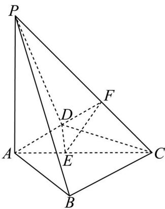

> [!faq]- 精品解析：2024年新课标全国Ⅰ卷数学真题（解析版）解析
>
> > [!success]- **【答案】** （1）证明见
>
> > [!note]- **【分析】**
> > （1）先证出 $AD \perp$ 平面 $PAB$ ，即可得 $AD \perp AB$ ，由勾股定理逆定理可得 $BC \perp AB$ ，从而
>
> > [!note]- **【解析】**
> > (1) 因为 $PA \perp$ 平面 $ABCD$ , 而 $AD \subset$ 平面 $ABCD$ , 所以 $PA \perp AD$ ,
> >
> > 又 $AD \perp PB$ ， $PB \cap PA = P$ ， $PB, PA \subset$ 平面 $PAB$ ，所以 $AD \perp$ 平面 $PAB$ ，
> >
> > 而 $AB \subset$ 平面 $PAB$ ，所以 $AD \perp AB$ .
> >
> > 因为 $BC^{2} + AB^{2} = AC^{2}$ ，所以 $BC \perp AB$ ，根据平面知识可知 AD // BC，
> >
> > 又 $AD \notin$ 平面 PBC， $BC \subset$ 平面 PBC，所以 $AD \parallel$ 平面 PBC。
> >
> > 【
> >
> > 小问 2
> >
> > 如图所示，过点 $D$ 作 $DE \perp AC$ 于 $E$ ，再过点 $E$ 作 $EF \perp CP$ 于 $F$ ，连接 $DF$ ，
> >
> > 因为 $PA \perp$ 平面 ABCD，所以平面 $PAC \perp$ 平面 ABCD，而平面 $PAC \cap$ 平面 ABCD = AC，
> >
> > 所以 $DE \perp$ 平面 PAC，又 $EF \perp CP$ ，所以 $CP \perp$ 平面 DEF，
> >
> > 根据二面角的定义可知， $\angle DFE$ 即为二面角 $A - CP - D$ 的平面角，
> >
> > 即 $\sin \angle DFE = \frac{\sqrt{42}}{7}$ ，即 $\tan \angle DFE = \sqrt{6}$
> >
> > 因为 $AD \perp DC$ ，设 $AD = x$ ，则 $CD = \sqrt{4 - x^2}$ ，由等面积法可得， $DE = \frac{x\sqrt{4 - x^2}}{2}$ ，
> >
> > 又 $CE = \sqrt{(4 - x^2) - \frac{x^2(4 - x^2)}{4}} = \frac{4 - x^2}{2}$ ，而 $\triangle EFC$ 为等腰直角三角形，所以 $EF = \frac{4 - x^2}{2\sqrt{2}}$
> >
> > $$
> > x \sqrt {4 - x ^ {2}}
> > $$
> >
> > 故 $\tan \angle DFE = \frac{2}{4 - x^2} = \sqrt{6}$ ，解得 $x = \sqrt{3}$ $AD = \sqrt{3}$
> >
> > 
