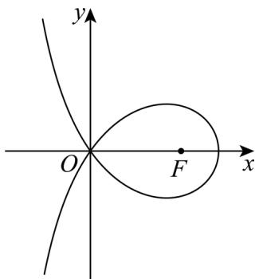

<!-- question-source:start -->
11. 造型可以做成美丽的丝带，将其看作图中曲线 C 的一部分. 已知 C 过坐标原点 O. 且 C 上的点满足横坐标大于 -2，到点 $F(2,0)$ 的距离与到定直线 $x = a (a < 0)$ 的距离之积为 4，则（）

A. $a = -2$ B.点 $(2\sqrt{2},0)$ 在 $C$ 上

C. $C$ 在第一象限的点的纵坐标的最大值为1 D.当点 $(x_0,y_0)$ 在 $C$ 上时， $y_{0}\leq \frac{4}{x_{0} + 2}$

【
<!-- question-source:end -->

![[高中/真题/按年份分类/2024/精品解析_2024年新课标全国Ⅰ卷数学真题_解析版_/选择题/题目/answers/Q00021550A1.md]]
