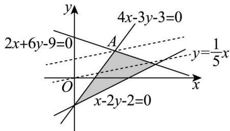

> [!faq]- 精品解析：2024年高考全国甲卷数学(文)真题（解析版）解析
>
> > [!success]- **【答案】** D
>
> > [!note]- **【分析】**
> > 画出可行域后，利用 z 的几何意义计算即可得.
>
> > [!note]- **【解析】**
> > 实数 满足 $\left\{\begin{aligned}&4x-3y-3\geq0\\ &x-2y-2\leq0\\ &2x+6y-9\leq0\end{aligned}\right.$ ，作出可行域如图：
> >
> > 
> >
> > 由 $z = x - 5y$ 可得 $y = \frac{1}{5} x - \frac{1}{5} z$
> >
> > 即 $z$ 的几何意义为 $y = \frac{1}{5} x - \frac{1}{5} z$ 的截距的 $-\frac{1}{5}$
> >
> > 则该直线截距取最大值时，z 有最小值，
> >
> > 此时直线 $y=\frac{1}{5}x-\frac{1}{5}z$ 过点 A，
> >
> > 联立 $\left\{ \begin{array}{l} 4x - 3y - 3 = 0 \\ 2x + 6y - 9 = 0 \end{array} \right.$ ，解得 $\left\{ \begin{array}{l} x = \frac{3}{2} \\ y = 1 \end{array} \right.$ ，即 $A\left(\frac{3}{2}, 1\right)$ ，
> >
> > 则 $z_{\mathrm{min}} = \frac{3}{2} - 5 \times 1 = -\frac{7}{2}$ .
> >
> > 故选：D.
