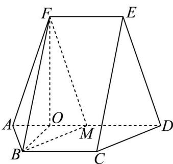

> [!faq]- 精品解析：2024年高考全国甲卷数学(文)真题（解析版）解析
>
> > [!success]- **【答案】** （1）证明见详解； (2) $\frac{6\sqrt{13}}{13}$
>
> > [!note]- **【分析】**
> > （1）结合已知易证四边形 $BCDM$ 为平行四边形，可证 $BM // CD$ ，进而得证；
> >
> > (2) 作 $FO \perp AD$ ，连接 $OB$ ，易证 $OB,OD,OF$ 三垂直，结合等体积法 $V_{M-ABF} = V_{F-ABM}$ 即可求解.
>
> > [!note]- **【解析】**
> > 【小问 1 详解】
> >
> > 因为 $BC // AD, BC = 2, AD = 4, M$ 为 $AD$ 的中点，所以 $BC // MD, BC = MD$
> >
> > 四边形 $BCDM$ 为平行四边形，所以 $BM // CD$ ，
> >
> > 又因为 BM ≠ 平面 CDE，CD ⊂ 平面 CDE，所以 BM // 平面 CDE；
> >
> > 【小问 2 详解】
> >
> > 如图所示，作 $BO \perp AD$ 交 $AD$ 于 $O$ ，连接 $OF$ ，因为四边形 $ABCD$ 为等腰梯形， $BC // AD, AD = 4,$
> >
> > AB = BC = 2，所以 CD = 2，
> >
> > 结合（1）BCDM 为平行四边形，可得 BM = CD = 2，
> >
> > 又 $AM = 2$ ，所以 $\triangle ABM$ 为等边三角形， $O$ 为 $AM$ 中点，所以 $OB = \sqrt{3}$
> >
> > 又因为四边形 ADEF 为等腰梯形，M 为 AD 中点，所以 EF = MD, EF // MD
> >
> > 四边形 EFMD 为平行四边形，FM = ED = AF ，所以 $\triangle AFM$ 为等腰三角形，
> >
> > $\triangle ABM$ 与 $\triangle AFM$ 底边上中点 $O$ 重合， $OF \perp AM$ ， $OF = \sqrt{AF^2 - AO^2} = 3$
> >
> > 因为 $OB^{2} + OF^{2} = BF^{2}$ ，所以 $OB\perp OF$ ，所以 $OB,OD,OF$ 互相垂直，
> >
> > 由等体积法可得 $V_{M-ABF}=V_{F-ABM}$ ， $V_{F-ABM}=\frac{1}{3}S_{\triangle ABM}\cdot FO=\frac{1}{3}\cdot\frac{\sqrt{3}}{4}\cdot2^{2}\cdot3=\sqrt{3}$
> >
> > $$
> > \cos \angle F A B = \frac {F A ^ {2} + A B ^ {2} - F B ^ {2}}{2 F A \cdot A B} = \frac {\left(\sqrt {1 0}\right) ^ {2} + 2 ^ {2} - \left(2 \sqrt {3}\right) ^ {2}}{2 \cdot \sqrt {1 0} \cdot 2} = \frac {1}{2 \sqrt {1 0}}, \sin \angle F A B = \frac {\sqrt {3 9}}{2 \sqrt {1 0}},
> > $$
> >
> > $$
> > S _ {\triangle F A B} = \frac {1}{2} F A \cdot A B \cdot \sin \angle F A B = \frac {1}{2} \cdot \sqrt {1 0} \cdot 2 \cdot \frac {\sqrt {3 9}}{2 \sqrt {1 0}} = \frac {\sqrt {3 9}}{2},
> > $$
> >
> > 设点 $M$ 到 $FAB$ 的距离为 $d$ ，则 $V_{M - FAB} = V_{F - ABM} = \frac{1}{3} \cdot S_{\triangle FAB} \cdot d = \frac{1}{3} \cdot \frac{\sqrt{39}}{2} \cdot d = \sqrt{3}$ ，
> >
> > 解得 $d = \frac{6\sqrt{13}}{13}$ ，即点 $_M$ 到 $ABF$ 的距离为 $\frac{6\sqrt{13}}{13}$
> >
> > 
