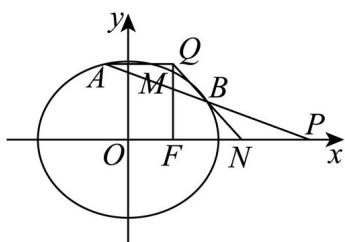

> [!faq]- 精品解析：2024年高考全国甲卷数学(文)真题（解析版）解析
>
> > [!success]- **【答案】** （1） $\frac{x^2}{4} +\frac{y^2}{3} = 1$ (2) 证明见解析
>
> > [!note]- **【分析】**
> > （1）设 $F(c,0)$ ，根据M的坐标及 $MF\perp x$ 轴可求基本量，故可求椭圆方程.
> >
> > (2) 设 $AB: y = k(x - 4)$ , $A(x_1, y_1)$ , $B(x_2, y_2)$ , 联立直线方程和椭圆方程, 用 $A, B$ 的坐标表示 $y_1 - y_Q$ , 结合韦达定理化简前者可得 $y_1 - y_Q = 0$ , 故可证 $AQ \perp y$ 轴.
>
> > [!note]- **【解析】**
> > 【小问1详解】
> >
> > 设 $F(c,0)$ ，由题设有c=1且 $\frac{b^{2}}{a}=\frac{3}{2}$ ，故 $\frac{a^{2}-1}{a}=\frac{3}{2}$ ，故a=2，故 $b=\sqrt{3}$ ，
> >
> > 故椭圆方程为 $\frac{x^{2}}{4}+\frac{y^{2}}{3}=1$ .
> >
> > 【小问 2 详解】
> >
> > 直线 AB 的斜率必定存在，设 $AB: y = k(x - 4)$ ， $A(x_{1}, y_{1})$ ， $B(x_{2}, y_{2})$ ，
> >
> > 
> >
> > 由 $\left\{\begin{aligned}3x^{2}+4y^{2}&=12\\ y=k(x-4)\end{aligned}\right.$ 可得 $\left(3+4k^{2}\right)x^{2}-32k^{2}x+64k^{2}-12=0$
> >
> > 故 $\Delta = 1024k^{4} - 4(3 + 4k^{2})(64k^{2} - 12) > 0$ ，故 $-\frac{1}{2} < k < \frac{1}{2}$
> >
> > 又 $x_{1} + x_{2} = \frac{32k^{2}}{3 + 4k^{2}}, x_{1}x_{2} = \frac{64k^{2} - 12}{3 + 4k^{2}}$
> >
> > 而 $N\left(\frac{5}{2},0\right)$ ，故直线 $BN:y = \frac{y_2}{x_2 - \frac{5}{2}}\left(x - \frac{5}{2}\right)$ ，故 $y_{Q} = \frac{-\frac{3}{2}y_{2}}{x_{2} - \frac{5}{2}} = \frac{-3y_{2}}{2x_{2} - 5},$
> >
> > 所以 $y_{1}-y_{Q}=y_{1}+\frac{3y_{2}}{2x_{2}-5}=\frac{y_{1}\times(2x_{2}-5)+3y_{2}}{2x_{2}-5}$
> >
> > $$
> > = \frac {k (x _ {1} - 4) \times (2 x _ {2} - 5) + 3 k (x _ {2} - 4)}{2 x _ {2} - 5}
> > $$
> >
> > $$
> > = k \frac {2 x _ {1} x _ {2} - 5 \left(x _ {1} + x _ {2}\right) + 8}{2 x _ {2} - 5} = k \frac {2 \times \frac {6 4 k ^ {2} - 1 2}{3 + 4 k ^ {2}} - 5 \times \frac {3 2 k ^ {2}}{3 + 4 k ^ {2}} + 8}{2 x _ {2} - 5}
> > $$
> >
> > $$
> > = k \frac {\frac {1 2 8 k ^ {2} - 2 4 - 1 6 0 k ^ {2} + 2 4 + 3 2 k ^ {2}}{3 + 4 k ^ {2}}}{2 x _ {2} - 5} = 0,
> > $$
> >
> > 故 $y_{1}=y_{Q}$ ，即 $AQ\perp y$ 轴.
> >
> > 【点睛】方法点睛：利用韦达定理法解决直线与圆锥曲线相交问题的基本步骤如下：
> >
> > (1) 设直线方程，设交点坐标为 $(x_{1}, y_{1}), (x_{2}, y_{2})$ ；
> >
> > (2) 联立直线与圆锥曲线的方程，得到关于 $x$ （或 $y$ ）的一元二次方程，注意 $\Delta$ 的判断；
> >
> > (3) 列出韦达定理;
> >
> > (4) 将所求问题或题中的关系转化为 $x_{1} + x_{2}$ 、 $x_{1}x_{2}$ （或 $y_{1} + y_{2}$ 、 $y_{1}y_{2}$ ）的形式；
> >
> > (5) 代入韦达定理求解.
> >
> > ## （二）选考题：共10分．请考生在第22、23题中任选一题作答，并用2B铅笔将所选题号涂
> >
> > 黑，多涂、错涂、漏涂均不给分，如果多做，则按所做的第一题计分。
