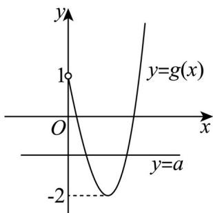

> [!faq]- 精品解析：2024年高考全国甲卷数学(文)真题（解析版）解析
>
> > [!success]- **【答案】** $(-2,1)$
>
> > [!note]- **【分析】**
> > 将函数转化为方程，令 $x^{3} - 3x = -(x - 1)^{2} + a$ ，分离参数 $a$ ，构造新函数
>
> > [!note]- **【解析】**
> > 令 $x^{3} - 3x = -(x - 1)^{2} + a$ ，即 $a = x^3 +x^2 -5x + 1$ ，令 $g(x) = x^3 +x^2 -5x + 1(x > 0),$
> >
> > $$
> > g ^ {\prime} (x) = 3 x ^ {2} + 2 x - 5 = (3 x + 5) (x - 1), \text {令} g ^ {\prime} (x) = 0 (x > 0) _ {\text {得} x = 1}
> > $$
> >
> > 当 $x\in (0,1)$ 时， $g^{\prime}(x) <   0$ ， $g(x)$ 单调递减，
> >
> > 当 $x \in (1, +\infty)$ 时， $g'(x) > 0$ ， $g(x)$ 单调递增， $g(0) = 1, g(1) = -2$
> >
> > 因为曲线 $y = x^{3} - 3x$ 与 $y = -(x - 1)^{2} + a$ 在 $(0, +\infty)$ 上有两个不同的交点，
> >
> > 所以等价于 $y = a$ 与 $g(x)$ 有两个交点，所以 $a \in (-2,1)$ .
> >
> > 
> >
> > 故答案为： $(-2,1)$
