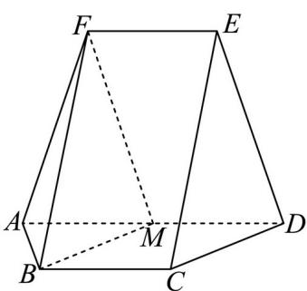

<!-- question-source:start -->
16. 如图，在以 $A, B, C, D, E, F$ 为顶点的五面体中，四边形ABCD与四边形ADEF均为等腰梯形， $BC // AD, EF // AD$ ， $AD = 4, AB = BC = EF = 2$ ， $ED = \sqrt{10}, FB = 2\sqrt{3}$ ， $M$ 为 $AD$ 的中点.

(1) 证明: $BM \parallel$ 平面 $CDE$ ;

(2) 求点 M 到 ABF 的距离.

【
<!-- question-source:end -->

![[高中/真题/按年份分类/2024/精品解析_2024年高考全国甲卷数学_文_真题_解析版_/解答题/题目/answers/Q00021595A1.md]]
