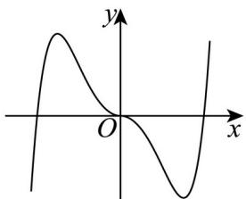
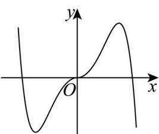
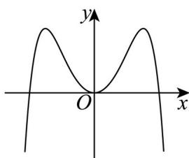
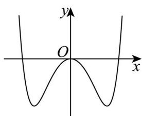

<!-- question-source:start -->
8. 函数 $f(x) = -x^2 + \left( e^x - e^{-x} \right) \sin x$ 在区间[-2.8, 2.8]的大致图像为（）

A.

B.

C.

D.

【
<!-- question-source:end -->

![[高中/真题/按年份分类/2024/精品解析_2024年高考全国甲卷数学_文_真题_解析版_/选择题/题目/answers/Q00021587A1.md]]
