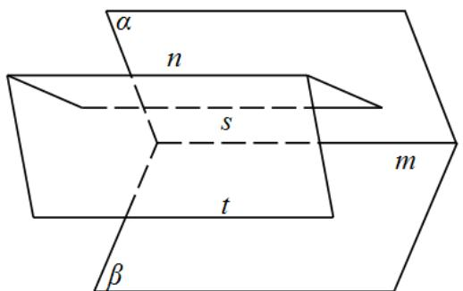

> [!faq]- 精品解析：2024年高考全国甲卷数学(理)真题（解析版）解析
>
> > [!success]- **【答案】** A
>
> > [!note]- **【分析】**
> > 根据线面平行 判定定理即可判断①；举反例即可判断②④；根据线面平行的性质即可判断③.
>
> > [!note]- **【解析】**
> > 对①，当 $n \subset \alpha$ ，因为 $m // n, m \subset \beta$ ，则 $n // \beta$ ，
> >
> > 当 $n \subset \beta$ ，因为 $m // n, m \subset \alpha$ ，则 $n // \alpha$ ，
> >
> > 当 $n$ 既不在 $\alpha$ 也不在 $\beta$ 内，因为 $m // n, m \subset \alpha, m \subset \beta$ ，则 $n // \alpha$ 且 $n // \beta$ ，故①正确；
> >
> > 对②，若 $m \perp n$ ，则 $n$ 与 $\alpha, \beta$ 不一定垂直，故②错误；
> >
> > 对③，过直线 $n$ 分别作两平面与 $\alpha, \beta$ 分别相交于直线 $s$ 和直线 $t$ ，
> >
> > 因为 $n // \alpha$ ，过直线 n 的平面与平面 $\alpha$ 的交线为直线 s，则根据线面平行的性质定理知 $n // s$ ，
> >
> > 同理可得 $n // t$ ，则 $s // t$ ，因为 $s \notin$ 平面 $\beta, t \subset \beta$ ，则 $s // \beta$ ，
> >
> > 因为 $s \subset \alpha, \alpha \cap \beta = m$ ，则 $s // m$ ，又因为 $n // s$ ，则 $m // n$ ，故③正确；
> >
> > 
> >
> > 对④，若 $\alpha \cap \beta = m, n$ 与 $\alpha$ 和 $\beta$ 所成的角相等，如果 $n / / \alpha, n / / \beta$ ，则 $m / / n$ ，故④错误；综上只有①③正确，故选：A.
