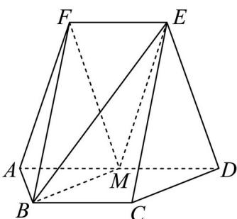

<!-- question-source:start -->
19. 如图，在以 A, B, C, D, E, F 为顶点的五面体中，四边形 ABCD 与四边形 ADEF 均为等腰梯形，
BC // AD, EF // AD, AD = 4, AB = BC = EF = 2, ED = $\sqrt{10}$ , FB = $2\sqrt{3}$ , M 为 AD 的中点.

<!-- question-source:end -->

![[高中/真题/按年份分类/2024/精品解析_2024年高考全国甲卷数学_理_真题_解析版_/解答题/题目/answers/Q00029364A1.md]]
