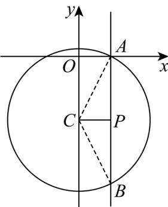

> [!faq]- 精品解析：2024年高考全国甲卷数学(理)真题（解析版）解析
>
> > [!success]- **【答案】** C 【
>
> > [!note]- **【分析】**
> > 结合等差数列性质将 $C$ 代换，求出直线恒过的定点，采用数形结合法即可求解.
>
> > [!note]- **【解析】**
> > 因为 $a, b, c$ 成等差数列，所以 $2b = a + c$ ， $c = 2b - a$ ，代入直线方程 $ax + by + c = 0$ 得 $ax + by + 2b - a = 0$ ，即 $a(x - 1) + b(y + 2) = 0$ ，令 $\left\{ \begin{array}{l} x - 1 = 0 \\ y + 2 = 0 \end{array} \right.$ 得 $\left\{ \begin{array}{l} x = 1 \\ y = -2 \end{array} \right.$ ，故直线恒过 $(1, -2)$ ，设 $P(1, -2)$ ，圆化为标准方程得： $C: x^2 + (y + 2)^2 = 5$ ，设圆心为 $C$ ，画出直线与圆的图形，由图可知，当 $PC \perp AB$ 时， $|AB|$ 最小， $|PC| = 1, |AC| = |r| = \sqrt{5}$ ，此时 $|AB| = 2|AP| = 2\sqrt{AC^2 - PC^2} = 2\sqrt{5 - 1} = 4$ .
> >
> > 
> >
> > 故选：C
> >
> > ##
