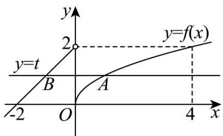
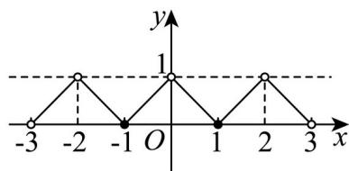
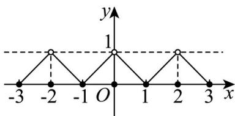
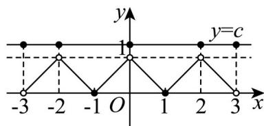
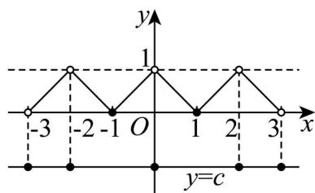
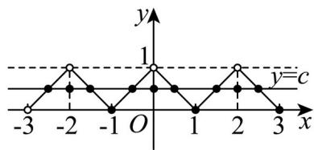

> [!faq]- 精品解析：2025年上海秋季高考数学真题（网络收集版）（解析版）_temp解析
>
> > [!success]- **【答案】** 详见解析
>
> > [!note]- **【分析】**
> > 本题未单列分析。
>
> > [!note]- **【解析】**
> > 【小问 1 详解】
> >
> > (1) $f\left(\frac{\pi}{3}\right) = \sin \frac{\pi}{3} = \frac{\sqrt{3}}{2}, f\left(\frac{\pi}{3} +\pi\right) = -\sin \frac{\pi}{3} = -\frac{\sqrt{3}}{2}$ 则 $\frac{\pi}{3}$ 不是 $M_{\pi}$ 中的元素.
> >
> > 【小问 2 详解】
> >
> > 法一：因为 $M_{a} \neq \emptyset$ ，则存在实数 $x_{0}$ 使得 $f(x_{0} + a) = f(x_{0})$ ，且 $a > 0$ ，
> >
> > 当 $x < 0$ 时， $f(x) = x + 2$ ，其在 $(- \infty, 0)$ 上严格单调递增，
> >
> > 当 $x \geq 0$ 时， $f(x) = \sqrt{x}$ ，其在 $[0, +\infty)$ 上也严格单调递增，
> >
> > 则 $x_0 < 0 \leq x_0 + a$ ，则 $x_0 + 2 = \sqrt{x_0 + a}$ ，
> >
> > 令 $x + 2 = 0$ ，解得 $x = -2$ ，则 $-2\leq x_0 <   0$
> >
> > $$
> > \text {则} a = \left(\sqrt {x _ {0} + a}\right) ^ {2} - x _ {0} = (x _ {0} + 2) ^ {2} - x _ {0} = \left(x _ {0} + \frac {3}{2}\right) ^ {2} + \frac {7}{4} \in \left[ \frac {7}{4}, 4\right).
> > $$
> >
> > 法二：作出该函数图象，则由题意知直线 $y = t$ 与该函数有两个交点，
> >
> > 由图知 $0 \leq t < 2$ ，假设交点分别为 $A(m, t)$ ， $B(n, t)$ ，
> >
> > 联立方程组 $\left\{ \begin{array}{l} \sqrt{m} = t \\ n + 2 = t \end{array} \right.$ 得 $a \neq |AB| = m - n = t^2 - (t - 2) = \left(t - \frac{1}{2}\right)^2 + \frac{7}{4} \in \left[\frac{7}{4}, 4\right)$
> >
> > 【小问3详解】
> >
> > 
> > (3) 对任意 $x_{0} \in (1,2), x_{0} - 2 \in (-1,0)$ ，因为其是偶函数，
> >
> > 则 $f(x_0 - 2) = f(2 - x_0)$ ，而 $2 - x_0 - (x_0 - 2) = 4 - 2x_0 \in (0, 2)$ ，
> >
> > 所以 $x_{0}-2\in M_{4-2x_{0}}\subseteq M_{2}$
> >
> > 所以 $f(x_{0})=f(x_{0}-2)=f(2-x_{0})$ ，因为 $x_{0}\in(1,2)$ ，则 $2-x_{0}\in(0,1)$ ，
> >
> > 所以 $f(x_{0})=f(2-x_{0})=1-(2-x_{0})=x_{0}-1$ ，所以 $f(x)=x-1, x\in(1,2)$ ，
> >
> > 所以当 $s\in (0,1)$ 时， $1 - s\in (0,1)$ ， $1 + s\in (1,2)$ ，则 $f(1 - s) = 1 - (1 - s) = s$
> >
> > $f(1 + s) = (1 + s) - 1 = s$ ，则 $f(1 - s) = f(1 + s)$
> >
> > 而 $1 + s - (1 - s) = 2s$ ， $(3 - s) - (1 - s) = 2$
> >
> > 则 $1 - s \in M_{2s} \subseteq M_2$ ，则 $f(1 - s) = f(3 - s)$ ，
> >
> > 所以当 $x \in (2,3)$ 时， $f(x) = f(x - 2) = 1 - (x - 2) = 3 - x$ ，而 $f(x)$ 为偶函数，画出函数图象如下：
> >
> > 
> >
> > 其中 $f(-3) = f(3), f(-2) = f(2), f
> > (0)$ ，但其对应的 $y$ 值均未知.
> >
> > 首先说明 $f(-3)=n\not\in(0,1)$ ，
> >
> > 若 $f(-3) = n \in (0,1)$ ，则 $-3 + n \in (-3, -2)$ ，易知此时 $f(x) = x + 3, x \in (-3, -2)$ ，
> >
> > 则 $f(-3 + n) = n$ ，所以 $f(-3)\in M_n\subseteq M_2$ ，而 $x\in [-1,0)$ 时， $f(x) = x + 1$
> >
> > 所以 $f(-3) = f(-1) = 0$ ，与 $f(-3) = n$ 矛盾，所以 $f(-3)\notin (0,1)$ ，即 $f(-3) = f(3)\notin (0,1)$
> >
> > $$
> > \text {令} y = f (x) - c = 0 \text {, 则} y = f (x) = c
> > $$
> >
> > 当 $c = 0$ 时，即使让 $f(-3) = f(3) = f(-2) = f(2) = f(0) = 0$ ，此时最多7个零点，
> >
> > 
> >
> > 当 $c \geq 1$ 时，若 $f(-2) = f(2) = f(0) = f(-3) = f(3) = c$ ，此时有5个零点，
> >
> > 故此时最多 5 个零点；
> >
> > 
> >
> > 当 $c < 0$ 时，若 $f(-2) = f(2) = f(0) = f(-3) = f(3) = c$ ，此时有5个零点，
> >
> > 故此时最多 5 个零点；
> >
> > 
> >
> > 当 $0 < c < 1$ 时，若 $f(-2) = f(2) = f(0) = c$ ，此时有3个零点，
> >
> > 若 $f(-3) = c \in (0,1)$ ，则 $-3 + c \in (-3 - 2)$ ，易知此时 $f(x) = x + 3$
> >
> > 则 $f(-3 + c) = c$ ，所以 $f(-3)\in M_c\subseteq M_2$ ，而 $x\in [-1,0)$ 时， $f(x) = x + 1$
> >
> > 所以 $f(-3)=f(-1)=0$ ，与 $f(-3)=p$ 矛盾，所以 $f(-3)\notin(0,1)$ ，
> >
> > 则最多在 $(-3,-2),(-2,-1),(-1,0),(0,1),(1,2),(2,3)$ 之间取得6个零点，
> >
> > 以及在 $x = -2,0,2$ 处成为零点，故不超过9个零点.
> >
> > 
> >
> > 综上，零点不超过9个.
