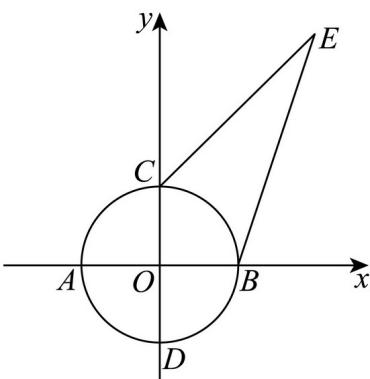

> [!faq]- 精品解析：2025年上海秋季高考数学真题（网络收集版）（解析版）_temp解析
>
> > [!success]- **【答案】** $2\sqrt{2}$
>
> > [!note]- **【分析】**
> > 先设 $z = a + b\mathrm{i}$ ，利用复数的乘方运算及概念确定 $ab = 0$ ，再根据复数的几何意义数形结合计算即可.
>
> > [!note]- **【解析】**
> > 设 $z=a+bi(a,b\in\mathbb{R}),\therefore\bar{z}=a-bi$
> >
> > 由题意可知 $z^2 = a^2 + 2ab\mathrm{i} - b^2 = \overline{z}^2 = a^2 - 2ab\mathrm{i} - b^2$ ，则 $ab = 0$ ，
> >
> > 又 $|z| = \sqrt{a^2 + b^2} \leq 1$ ，由复数的几何意义知 $z$ 在复平面内对应的点 $Z(a, b)$ 在单位圆内部（含边界）的坐
> >
> > 标轴上运动，如图所示即线段 $AB, CD$ 上运动，
> >
> > 设 $E(2,3)$ ，则 $\left|z - 2 - 3\mathrm{i}\right| = \left|ZE\right|$ ，由图象可知 $\left|BE\right| = \sqrt{10} >\left|CE\right| = 2\sqrt{2}$
> >
> > 所以 $\left| ZE \right|_{\min} = 2\sqrt{2}$
> >
> > 故答案为： $2\sqrt{2}$
> >
> > 
