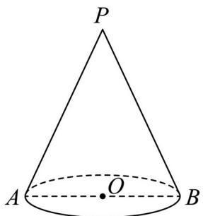

<!-- question-source:start -->
18. 如图，P 是圆锥的顶点，O 是底面圆心，AB 是底面直径，且 AB = 2。

$$
\frac {\pi}{3}
$$

(1) 若直线 $PA$ 与圆锥底面的所成角为 3，求圆锥的侧面积；

(2) 已知 $Q$ 是母线 $PA$ 的中点，点 $C$ 、 $D$ 在底面圆周上，且弧 $AC$ 的长为 $\frac{\pi}{3}$ ， $CD \parallel AB$ 。设点 $M$ 在线段

OC 上，证明：直线 $Q M \parallel$ 平面 PBD.
<!-- question-source:end -->

![[高中/真题/按年份分类/2025/精品解析_2025年上海秋季高考数学真题_网络收集版__解析版_/三_解答题_本大题共5题_第17_19题每题14分_第20_21题每题18分_共78分_解答下/题目/answers/Q00020567A1.md]]
