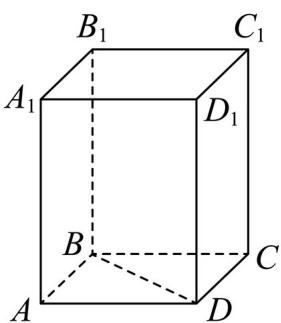

<!-- question-source:start -->
7. 如图，在正四棱柱 $ABCD - A_{1}B_{1}C_{1}D_{1}$ 中， $BD = 4\sqrt{2}, DB_{1} = 9$ ，则该正四棱柱的体积为 \_\_\_\_。

【
<!-- question-source:end -->

![[高中/真题/按年份分类/2025/精品解析_2025年上海秋季高考数学真题_网络收集版__解析版_/填空题/题目/answers/Q00021525A1.md]]
