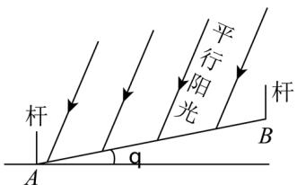
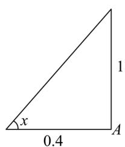
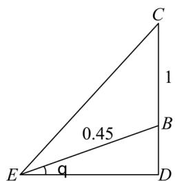

> [!faq]- 精品解析：2025年上海秋季高考数学真题（网络收集版）（解析版）解析
>
> > [!success]- **【答案】** $12
>
> > [!note]- **【分析】**
> > 先根据在 A 处的旗杆算出阳光和水平面的夹角，然后结合 B 处的旗杆算出斜面角.
>
> > [!note]- **【解析】**
> > 如图，在A处， $\tan x = \frac{1}{0.4} = 2.5$ ，在 $B$ 处满足 $\tan \angle CED = 2.5$
> >
> > (其中 $ED \parallel$ 水平面，CE 是射过 B 处杆子最高点的光线，光线交斜面于 E )，
> >
> > 故设 BD = y，则 $ED = \frac{1 + y}{2.5}$ ，
> >
> > 由勾股定理， $y^{2}+\left(\frac{1+y}{2.5}\right)^{2}=0.45^{2}$ ，解得 $y\approx0.098$ ，
> >
> > 于是 $\theta = \arcsin \frac{0.098}{0.45} \approx 12.58^{\circ}$
> >
> > 故答案为： $12.58^{\circ}$
> >
> > 
> >
> > 
> >
> > 
