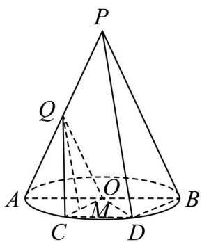

> [!faq]- 精品解析：2025年上海秋季高考数学真题（网络收集版）（解析版）解析
>
> > [!success]- **【答案】** (1) $2 \pi$ (2) 证明见
>
> > [!note]- **【分析】**
> > （1）由线面角先算出母线长，然后根据侧面积公式求解.
>
> > [!note]- **【解析】**
> > 由题知， $\angle PAB = \frac{\pi}{3}$ ，即轴截面 $\triangle ABP$ 是等边三角形，故 $PA = AB = 2$
> >
> > 底面周长为 $2\pi \times 1 = 2\pi$ ，则侧面积为： $\frac{1}{2}\times 2\times 2\pi = 2\pi$
> >
> > 【
> >
> > 小问 2
> >
> > 由题知 $AQ = QP, AO = OB$ ，则根据中位线性质， $QO \parallel PB$ ，
> >
> > 又 $QO \notin$ 平面PBD， $PB \subset$ 平面PBD，则 $QO //$ 平面PBD
> >
> > 由于 $\overline{AC} = \frac{\pi}{3}$ ，底面圆半径是1，则 $\angle AOC = \frac{\pi}{3}$ ，又 $CD\parallel AB$ ，则 $\angle OCD = \frac{\pi}{3}$
> >
> > 又 OC = OD，则 $\triangle OCD$ 为等边三角形，则 CD = 1，
> >
> > 于是 $CD \parallel BO$ 且 $CD = OB$ ，则四边形 $OBDC$ 是平行四边形，故 $OC \parallel BD$ ，
> >
> > 又 $OC \notin$ 平面 $PBD$ , $BD \subset$ 平面 $PBD$ , 故 $OC //$ 平面 $PBD$ .
> >
> > 又 $OC \cap OQ = 0, OC, OQ \subset$ 平面 $QOC$
> >
> > 根据面面平行的判定，于是平面 $QOC //$ 平面PBD，
> >
> > 又 $M \in OC$ ，则 $QM \subset$ 平面 $QOC$ ，则 $QM //$ 平面 $PBD$
> >
> > 
