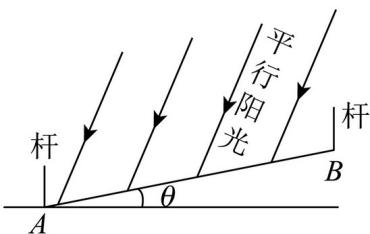

<!-- question-source:start -->
11. 小申同学观察发现, 生活中有些时候影子可以完全投射在斜面上。某斜面上有两根长为 1 米的垂直于水平面放置的杆子, 与斜面的接触点分别为 $A$ 、 $B$ , 它们在阳光的照射下呈现出影子, 阳光可视为平行光: 其中一根杆子的影子在水平面上, 长度为 0.4 米; 另一根杆子的影子完全在斜面上, 长度为 0.45 米。则斜面

的底角 $\theta =$ \_\_\_\_ 。（结果用角度制表示，精确到 $0\theta1^{\circ}$ ）

<!-- question-source:end -->

![[高中/真题/按年份分类/2025/精品解析_2025年上海秋季高考数学真题_网络收集版__解析版__temp/填空题/题目/answers/Q00020539A1.md]]
